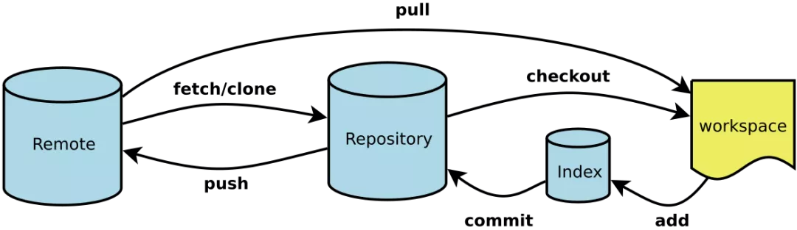

# 简介

- Workspace：工作区
- Index / Stage：暂存区
- Repository：仓库区（或本地仓库）
- Remote：远程仓库

git stash

git stash list

git stash pop=git stash apply + git stash drop

 git remote –v

 git push origin master

git remote add origin https://github.com/...

git config --list

