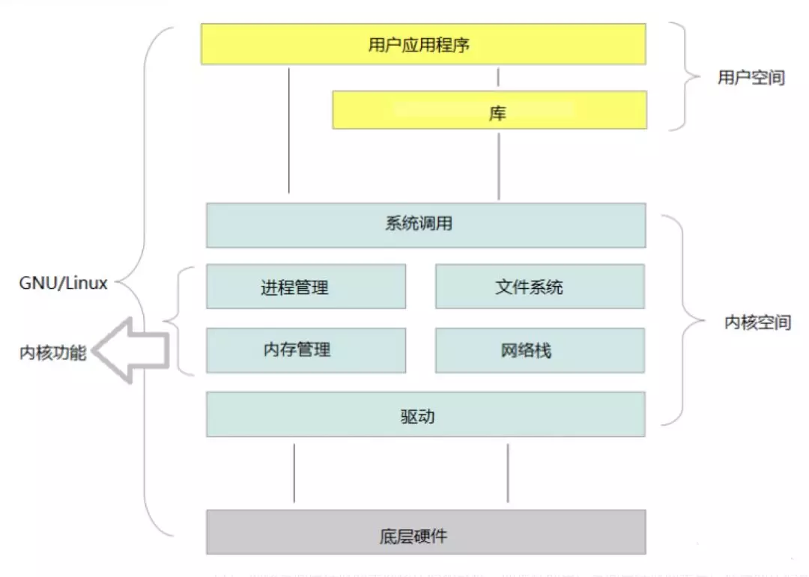

# IO

I/O（ INPUT/OUTPUT），包括文件 I/O、网络 I/O。计算机世界里的速度鄙视：

- **内存读数据：**纳秒级别。
- **千兆网卡读数据：**微秒级别。1 微秒= 1000 纳秒，网卡比内存慢了千倍。 
- **磁盘读数据：**毫秒级别。1 毫秒=1000微秒 ，硬盘比网卡慢了100倍。 
- CPU 一个时钟周期 1 纳秒上下，内存算是比较接近 CPU 的，其他都等不起。

 

CPU 处理数据的速度远大于 I/O 准备数据的速度 。任何编程语言都会遇到这种 CPU 处理速度和 I/O 速度不匹配的问题！

1s(秒)=10^3ms(毫秒)=10^6μs(微秒)=10^9ns(纳秒)=10^12ps(皮秒)=10^15fs(飞秒)=10^18as(阿秒)=10^21zm(仄秒)=10^24ym(幺秒) 

### **内核空间 、用户空间** 

#### 内核态、用户态：

**服务端处理网络请求的过程**

