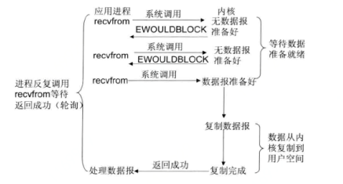
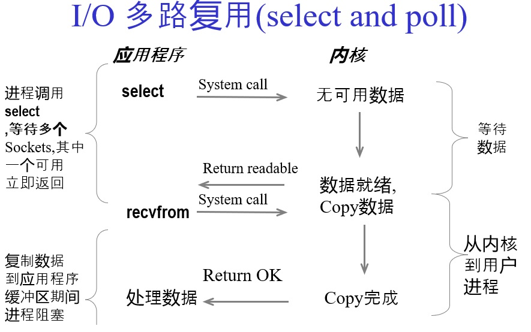
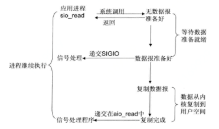
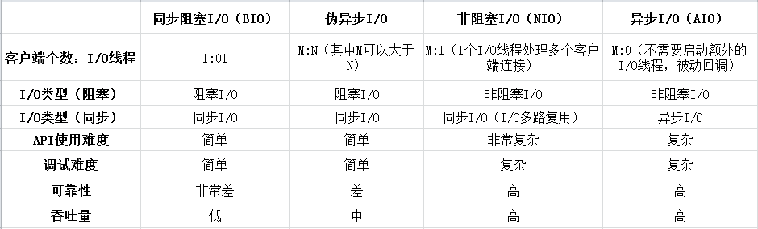

# NIO模型 网络编程

### 二、非阻塞I/O

　　非阻塞IO很简单，通过fcntl（POSIX）或ioctl（Unix）设为非阻塞模式，



应用进程调用**recvfrom**系统调用，如果内核数据没有准备好，会直接返回一个EWOULDBLOCK错误，应用进程不会阻塞，但是需要应用进程不断的轮询调用**recvfrom**，直到内核数据准备就绪，之后等待数据从内核复制到用户空间（这段时间会阻塞，但是耗时极小），复制完成后返回

### 三、I/O多路复用



多路复用是指使用一个线程来检查多个文件描述符（Socket）的就绪状态，传入多个文件描述符（FileDescription，简称FD），如果有一个文件描述符（FileDescription）就绪，则返回，否则阻塞直到超时。

JDK中NIO使用多路复用的IO模型，通过把多个IO阻塞复用到一个select的阻塞上，实现系统在单线程中可以同时处理多个客户端请求，节省系统开销，在JDK1.4和1.5 update10版本之前，JDK的Selector基于select/poll模型实现，在JDK 1.5 update10以上的版本，底层使用epoll代替了select/poll

epoll较select/poll的优点在于：

1. epoll支持打开的文件描述符数量不在受限制，select/poll可以打开的文件描述符数量有限
2. select/poll使用轮询方式遍历整个文件描述符的集合，epoll基于每个文件描述符的callback函数回调

**select，poll，epoll**都是IO多路复用的机制。I/O多路复用就是通过一种机制，一个进程可以监视多个描述符，一旦某个描述符就绪（一般是读就绪或者写就绪），能够通知程序进行相应的读写操作。但select，poll，epoll本质上都是同步I/O，因为他们都需要在读写事件就绪后自己负责进行读写，也就是说这个读写过程是阻塞的，而异步I/O则无需自己负责进行读写

NIO提供了两套不同的套接字通道实现网络编程，服务端：ServerSocketChannel和客户端SocketChannel，两种通道都支持阻塞和非阻塞模式

```
服务端代码

服务端接受客户端发送的消息输出，并给客户端发送一个消息

        //创建多路复用选择器Selector
        Selector selector=Selector.open();
        //创建一个通道对象Channel，监听9001端口
        ServerSocketChannel channel = ServerSocketChannel.open().bind(new InetSocketAddress(9001));
        //设置channel为非阻塞
        channel.configureBlocking(false);
        //
        /**
         * 1.SelectionKey.OP_CONNECT：连接事件
         * 2.SelectionKey.OP_ACCEPT：接收事件
         * 3.SelectionKey.OP_READ：读事件
         * 4.SelectionKey.OP_WRITE：写事件
         *
         * 将channel绑定到selector上并注册OP_ACCEPT事件
         */
        channel.register(selector,SelectionKey.OP_ACCEPT);

        while (true){
            //只有当OP_ACCEPT事件到达时，selector.select()会返回（一个key），如果该事件没到达会一直阻塞
            selector.select();
            //当有事件到达了，select()不在阻塞，然后selector.selectedKeys()会取到已经到达事件的SelectionKey集合
            Set keys = selector.selectedKeys();
            Iterator iterator = keys.iterator();
            while (iterator.hasNext()){
                SelectionKey key = (SelectionKey) iterator.next();
                //删除这个SelectionKey，防止下次select方法返回已处理过的通道
                iterator.remove();
                //根据SelectionKey状态判断
                if (key.isConnectable()){
                    //连接成功
                } else if (key.isAcceptable()){
                    /**
                     * 接受客户端请求
                     *
                     * 因为我们只注册了OP_ACCEPT事件，所以有客户端链接上，只会走到这
                     * 我们要做的就是去读取客户端的数据，所以我们需要根据SelectionKey获取到serverChannel
                     * 根据serverChannel获取到客户端Channel，然后为其再注册一个OP_READ事件
                     */
                    // 1，获取到ServerSocketChannel
                    ServerSocketChannel serverChannel = (ServerSocketChannel) key.channel();
                    // 2，因为已经确定有事件到达，所以accept()方法不会阻塞
                    SocketChannel clientChannel = serverChannel.accept();
                    // 3，设置channel为非阻塞
                    clientChannel.configureBlocking(false);
                    // 4，注册OP_READ事件
                    clientChannel.register(key.selector(),SelectionKey.OP_READ);
                } else if (key.isReadable()){
                    // 通道可以读数据
                    /**
                     * 因为客户端连上服务器之后，注册了一个OP_READ事件发送了一些数据
                     * 所以首先还是需要先获取到clientChannel
                     * 然后通过Buffer读取clientChannel的数据
                     */
                    SocketChannel clientChannel = (SocketChannel) key.channel();
                    ByteBuffer byteBuffer = ByteBuffer.allocate(BUF_SIZE);
                    long bytesRead = clientChannel.read(byteBuffer);
                    while (bytesRead>0){
                        byteBuffer.flip();
                        System.out.println("client data ："+new String(byteBuffer.array()));
                        byteBuffer.clear();
                        bytesRead = clientChannel.read(byteBuffer);
                    }

                    /**
                     * 我们服务端收到信息之后，我们再给客户端发送一个数据
                     */
                    byteBuffer.clear();
                    byteBuffer.put("客户端你好，我是服务端，你看这NIO多难".getBytes("UTF-8"));
                    byteBuffer.flip();
                    clientChannel.write(byteBuffer);
                } else if (key.isWritable() && key.isValid()){
                    //通道可以写数据
                }

            }
        }
客户端代码

客户端连接上服务端后，先给服务端发送一个消息，并接受服务端发送的消息

Selector selector = Selector.open();
SocketChannel clientChannel = SocketChannel.open();
//将channel设置为非阻塞
clientChannel.configureBlocking(false);
//连接服务器
clientChannel.connect(new InetSocketAddress(9001));
//注册OP_CONNECT事件
clientChannel.register(selector, SelectionKey.OP_CONNECT);
while (true){
    //如果事件没到达就一直阻塞着
    selector.select();
    Iterator<SelectionKey> iterator = selector.selectedKeys().iterator();
    while (iterator.hasNext()){
        SelectionKey key = iterator.next();
        iterator.remove();
        if (key.isConnectable()){
            /**
             * 连接服务器端成功
             *
             * 首先获取到clientChannel，然后通过Buffer写入数据，然后为clientChannel注册OP_READ时间
             */
            clientChannel = (SocketChannel) key.channel();
            if (clientChannel.isConnectionPending()){
                clientChannel.finishConnect();
            }
            clientChannel.configureBlocking(false);
            ByteBuffer byteBuffer = ByteBuffer.allocate(1024);
            byteBuffer.clear();
            byteBuffer.put("服务端你好，我是客户端，你看这NIO难吗".getBytes("UTF-8"));
            byteBuffer.flip();
            clientChannel.write(byteBuffer);
            clientChannel.register(key.selector(),SelectionKey.OP_READ);
        } else if (key.isReadable()){
            //通道可以读数据
            clientChannel = (SocketChannel) key.channel();
            ByteBuffer byteBuffer = ByteBuffer.allocate(BUF_SIZE);
            long bytesRead = clientChannel.read(byteBuffer);
            while (bytesRead>0){
                byteBuffer.flip();
                System.out.println("server data ："+new String(byteBuffer.array()));
                byteBuffer.clear();
                bytesRead = clientChannel.read(byteBuffer);
            }
        } else if (key.isWritable() && key.isValid()){
            //通道可以写数据
        }
    }
}
```

使用原生NIO类库十分复杂，NIO的类库和Api繁杂，使用麻烦，需要对网络编程十分熟悉，才能编写出高质量的NIO程序，所以并不建议直接使用原生NIO进行网络编程，而是使用一些成熟的框架，比如Netty

### AIO

JDK1.7升级了Nio类库，成为Nio2.0，最主要的是提供了异步文件的IO操作，以及事件驱动IO，AIO的异步套接字通道是真正的异步非阻塞IO

#### 异步IO模型



在Linux系统中，应用进程发起read操作，立刻可以去做其他的事，内核会将数据准备好并且复制到用空间后告诉应用进程，数据已经复制完成read操作

#### aio模型 网络编程

**异步操作**

aio不需要通过多路复用器对注册的通道进行轮询操作就可以实现异步读写，从而简化了NIO的编程模型

aio通过异步通道实现异步操作，异步通道提供了两种方式获取操作结果：

1. 通过Future类来获取异步操作的结果，不过要注意的是future.get()是阻塞方法，会阻塞线程
2. 通过回调的方式进行异步，通过传入一个CompletionHandler的实现类进行回调，CompletionHandler定义了两个方法，completed和failed两方法分别对应成功和失败

Aio中的Channel都支持以上两种方式

AIO提供了对应的异步套接字通道实现网络编程，服务端：AsynchronousServerSocketChannel和客户端AsynchronousSocketChannel

```
服务端

服务端向客户端发送消息，并接受客户端发送的消息

AsynchronousServerSocketChannel server = AsynchronousServerSocketChannel.open().bind(new InetSocketAddress("127.0.0.1", 9001));
//异步接受请求
server.accept(null, new CompletionHandler<AsynchronousSocketChannel, Void>() {
    //成功时
    @Override
    public void completed(AsynchronousSocketChannel result, Void attachment) {
        try {
            ByteBuffer buffer = ByteBuffer.allocate(1024);
            buffer.put("我是服务端，客户端你好".getBytes());
            buffer.flip();
            result.write(buffer, null, new CompletionHandler<Integer, Void>(){
                @Override
                public void completed(Integer result, Void attachment) {
                    System.out.println("服务端发送消息成功");
                }

                @Override
                public void failed(Throwable exc, Void attachment) {
                    System.out.println("发送失败");
                }
            });

            ByteBuffer readBuffer = ByteBuffer.allocate(1024);
            result.read(readBuffer, null, new CompletionHandler<Integer, Void>() {
                //成功时调用
                @Override
                public void completed(Integer result, Void attachment) {
                    System.out.println(new String(readBuffer.array()));
                }
                //失败时调用
                @Override
                public void failed(Throwable exc, Void attachment) {
                    System.out.println("读取失败");
                }
            });

        } catch (Exception e) {
            e.printStackTrace();
        }
    }
    //失败时
    @Override
    public void failed(Throwable exc, Void attachment) {
        exc.printStackTrace();
    }
});
//防止线程执行完
TimeUnit.SECONDS.sleep(1000L);
客户端

客户端向服务端发送消息，并接受服务端发送的消息

AsynchronousSocketChannel client = AsynchronousSocketChannel.open();
Future<Void> future = client.connect(new InetSocketAddress("127.0.0.1", 9001));
//阻塞，获取连接
future.get();

ByteBuffer buffer = ByteBuffer.allocate(1024);
//读数据
client.read(buffer, null, new CompletionHandler<Integer, Void>() {
    //成功时调用
    @Override
    public void completed(Integer result, Void attachment) {
        System.out.println(new String(buffer.array()));
    }
    //失败时调用
    @Override
    public void failed(Throwable exc, Void attachment) {
        System.out.println("客户端接收消息失败");
    }
});

ByteBuffer writeBuffer = ByteBuffer.allocate(1024);
writeBuffer.put("我是客户端，服务端你好".getBytes());
writeBuffer.flip();
//阻塞方法
Future<Integer> write = client.write(writeBuffer);
Integer r = write.get();
if(r>0){
    System.out.println("客户端消息发送成功");
}
//休眠线程
TimeUnit.SECONDS.sleep(1000L);
```

各IO模型对比：



