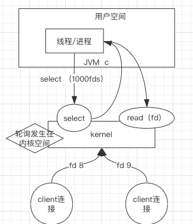
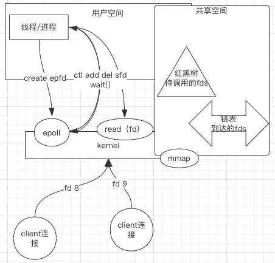

# Select、Poll、Epoll

#### **①I/O 多路复用：Select**



 

 

**简介：**有连接请求抵达了再检查处理。

缺点如下：

- 句柄上限：默认打开的 FD 有限制，1024 个。 
- 重复初始化：每次调用 select()，需要把 FD 集合从用户态拷贝到内核态，内核进行遍历。 
- 逐个排查所有 FD 状态效率不高。

 

服务端的 Select 就像一块布满插口的插排，Client 端的连接连上其中一个插口，建立了一个通道，然后再在通道依次注册读写事件。

 

一个就绪、读或写事件处理时一定记得删除，要不下次还能处理。 

```
public static void main(String[] args) throws IOException {
        ServerSocketChannel ssc = ServerSocketChannel.open();//管道型ServerSocket
        ssc.socket().bind(new InetSocketAddress(Constant.HOST, Constant.PORT));
        ssc.configureBlocking(false);//设置非阻塞
        System.out.println(" NIO single server started, listening on :" + ssc.getLocalAddress());
        Selector selector = Selector.open();
        ssc.register(selector, SelectionKey.OP_ACCEPT);//在建立好的管道上，注册关心的事件 就绪
        while(true) {
            selector.select();
            Set<SelectionKey> keys = selector.selectedKeys();
            Iterator<SelectionKey> it = keys.iterator();
            while(it.hasNext()) {
                SelectionKey key = it.next();
                it.remove();//处理的事件，必须删除
                handle(key);
            }
        }
    }
    private static void handle(SelectionKey key) throws IOException {
        if(key.isAcceptable()) {
                ServerSocketChannel ssc = (ServerSocketChannel) key.channel();
                SocketChannel sc = ssc.accept();
                sc.configureBlocking(false);//设置非阻塞
                sc.register(key.selector(), SelectionKey.OP_READ );//在建立好的管道上，注册关心的事件 可读
        } else if (key.isReadable()) { //flip
            SocketChannel sc = null;
                sc = (SocketChannel)key.channel();
                ByteBuffer buffer = ByteBuffer.allocate(512);
                buffer.clear();
                int len = sc.read(buffer);
                if(len != -1) {
                    System.out.println("[" +Thread.currentThread().getName()+"] recv :"+ new String(buffer.array(), 0, len));
                }
                ByteBuffer bufferToWrite = ByteBuffer.wrap("HelloClient".getBytes());
                sc.write(bufferToWrite);
        }
    }
```

#### **②I/O 多路复用：Poll**



 

 

**简介：**设计新的数据结构(链表)提供使用效率。

Poll 和 Select 相比在本质上变化不大，只是 Poll 没有了 Select 方式的最大文件描述符数量的限制。

**缺点：**逐个排查所有 FD 状态效率不高。

####  

#### **③I/O 多路复用：Epoll**

**简介：**没有 FD 个数限制，用户态拷贝到内核态只需要一次，使用事件通知机制来触发。

通过 epoll_ctl 注册 FD，一旦 FD 就绪就会通过 Callback 回调机制来激活对应 FD，进行相关的 I/O 操作。

 

缺点如下：

- - 跨平台，Linux 支持最好。 
  - 底层实现复杂。 
  - 同步。

```
public static void main(String[] args) throws Exception {
        final AsynchronousServerSocketChannel serverChannel = AsynchronousServerSocketChannel.open()
                .bind(new InetSocketAddress(Constant.HOST, Constant.PORT));
        serverChannel.accept(null, new CompletionHandler<AsynchronousSocketChannel, Object>() {
            @Override
            public void completed(final AsynchronousSocketChannel client, Object attachment) {
                serverChannel.accept(null, this);
                ByteBuffer buffer = ByteBuffer.allocate(1024);
                client.read(buffer, buffer, new CompletionHandler<Integer, ByteBuffer>() {
                    @Override
                    public void completed(Integer result, ByteBuffer attachment) {
                        attachment.flip();
                        client.write(ByteBuffer.wrap("HelloClient".getBytes()));//业务逻辑
                    }
                    @Override
                    public void failed(Throwable exc, ByteBuffer attachment) {
                        System.out.println(exc.getMessage());//失败处理
                    }
                });
            }

            @Override
            public void failed(Throwable exc, Object attachment) {
                exc.printStackTrace();//失败处理
            }
        });
        while (true) {
            //不while true main方法一瞬间结束
        }
    }
```

当然上面的缺点相比较它的优点都可以忽略。JDK 提供了异步方式实现，但在实际的 Linux 环境中底层还是 Epoll，只不过多了一层循环，不算真正的异步非阻塞。

 

而且就像上图中代码调用，处理网络连接的代码和业务代码解耦得不够好。


Netty 提供了简洁、解耦、结构清晰的 API。

```
public static void main(String[] args) {
        new NettyServer().serverStart();
        System.out.println("Netty server started !");
    }

    public void serverStart() {
        EventLoopGroup bossGroup = new NioEventLoopGroup();
        EventLoopGroup workerGroup = new NioEventLoopGroup();
        ServerBootstrap b = new ServerBootstrap();
        b.group(bossGroup, workerGroup)
                .channel(NioServerSocketChannel.class)
                .childHandler(new ChannelInitializer<SocketChannel>() {
                    @Override
                    protected void initChannel(SocketChannel ch) throws Exception {
                        ch.pipeline().addLast(new Handler());
                    }
                });
        try {
            ChannelFuture f = b.localAddress(Constant.HOST, Constant.PORT).bind().sync();
            f.channel().closeFuture().sync();
        } catch (InterruptedException e) {
            e.printStackTrace();
        } finally {
            workerGroup.shutdownGracefully();
            bossGroup.shutdownGracefully();
        }
    }
}

class Handler extends ChannelInboundHandlerAdapter {
    @Override
    public void channelRead(ChannelHandlerContext ctx, Object msg) throws Exception {
        ByteBuf buf = (ByteBuf) msg;
        ctx.writeAndFlush(msg);
        ctx.close();
    }

    @Override
    public void exceptionCaught(ChannelHandlerContext ctx, Throwable cause) throws Exception {
        cause.printStackTrace();
        ctx.close();
    }
}
```

bossGroup 处理网络请求的大管家（们），网络连接就绪时，交给 workGroup 干活的工人（们）。