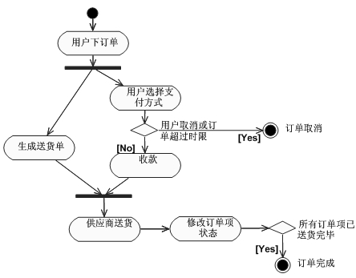
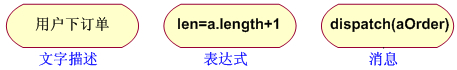
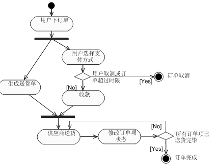
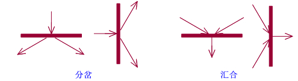
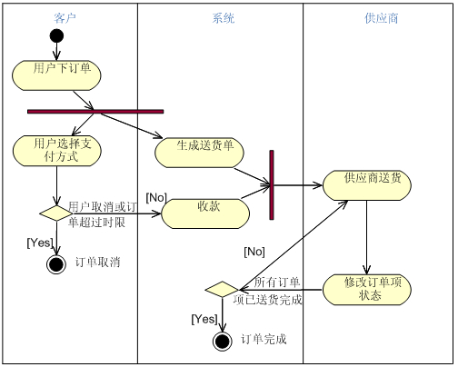

# 活动图

https://www.cnblogs.com/hellowzl/p/10130470.html

活动图：用于表示系统中各种活动的次序，它的应用非常广泛，即可用来描述用例的工作流程，也可用来描述类中某个方法的操作行为。常用于表示业务流程，对系统功能建模，强调对象之间的控制流。活动图是由状态图变化而来的，活动图依据对象状态的变化来捕获动作。活动图中一个活动结束后将立即进入下一个活动，状态图中状态的变迁可能需要事件的触发。主要用于系统功能建模。

​      活动图VS传统流程图：程序流程图明确地指定了每个活动的先后顺序，而活动图仅描述了活动和必要的工作顺序，这是两者的根本区别。另外，流程图限于顺序进程，而活动图支持并发进程。

​      活动图VS状态图：状态图注重于由事件驱动的系统的变化状态；活动图注重于从活动到活动的控制流。活动图是状态机的一种特殊情况，其中全部或大多数状态是活动状态，并且全部或大多数转换时通过源状态中活动的完成来触发的。活动图适应状态机的全部特征。活动图和状态图在对一个对象的生命周期建模时都是有用的。

​      注：数据流图和流程图是结构化方法中的概念。

 

类模型体现了系统的静态结构，用例模型则从用户的角度对系统的动态行为进行了宏观建模，并通过交互模型将对象与消息有机地结合在一起。但有些时候，我们还需要更好地表示行为的细节，这就可以借助于活动图和状态图来实现。

   1．简单活动图

   图2-10展示了一个用户订单处理过程的流程图，接下来就结合这个基本的活动图来学会正确的阅读方法。

图2-10用户订单处理简单活动图

   （1）初始节点和活动终点。在活动图中有两个特殊的节点，一个用来表示活动的初始节点，它用一个实心圆表示，在一张不包括子图的活动图中有且只有一个初始节点。而另一个则是表示活动处理完成的活动终点，它用一个圆圈内加一个实心圆来表示，在活动图中可能包含多个活动终点。例如，在本例中，用户取消和订单完成就是两个可能的活动终点。

   （2）活动节点。活动节点是活动图中最主要的元素之一，它用来表示一个活动，例如图2-10中的“用户下订单”、“用户选择支付方式”、“生成送货单”等都是活动节点。在UML中，活动节点所描述的活动可以是原子的动作，也可以是能进一步分解的一系列操作；它可以是文字描述、表达式、事件等。在图2-11中列出的就是一些可能的活动节点描述。

图2-11活动节点

   （3）转换。当一个活动结束时，控制流就会马上传递给下一个活动节点，在活动图中称之为转换，用一条带箭头的直线来表示。如果需要对这些转换设置一些条件，使其在满足特定的条件时才触发，则可以借助监护条件来完成。

​    （4）分支与监护条件。对于任何一个控制流而言，都一定会存在分支、循环等形式的控制流。在活动图中，分支用一个菱形表示，它有一个进入转换（箭头从外指向分支符号），一个或多个离开转换（箭头从分支符号指向外）。而每个离开转换上都会有一个监护条件，用来表示满足什么条件的时候执行该转换。但要注意，在多个离开转换上的监护条件不能有矛盾，否则就会使得流程产生混乱。

   虽然在活动图中，没有直接提供表示循环的建模元素，但可以利用分支来实现“循环”控制流的表示。例如，在图2-10所示的例子中，一个订单可能对应多个供应商，如果订单没有完成的话，说明还有供应商没有完成送货任务，因此可以在分支“所有订单项已送货完毕”中，增加一个离开转换，指向“供应商送货”活动节点来表示这种循环，修改后的活动图如图2-12所示。

图2-12修改后的简单活动图

   （5）分岔与汇合。在实际的控制流中，除了顺序结构、分支结构和循环结构之外，还可能存在并发的事件流。在UML中，可以采用一个同步线来说明这些并行控制流的分岔和汇合。如图2-13所示，同步线是一条水平或垂直的粗线段。如图2-13所示，分岔是有一个进入转换，两个或多个离开转换；而汇合则是两个或多个进入转换，一个离开转换。例如，在本例中，当“用户下订单”之后，系统将并行处理两方面事务：一是根据订单所涉及的产品生成送货单；二是处理用户的支付。这两类事件是并发处理。当这两个并发处理都完成时，这时控制流汇合，转到“供应商送货”活动中。

图2-13分岔与汇合图示

   2．带泳道的活动图

   简单活动图虽然明确地说明了整个控制流的过程，但是却没有说明每个活动是由谁做的。对应到编程而言，就是没有明确地表示出每个活动是由什么类来负责的；对应到业务建模，就是没有明确地表示出机构中的哪一个部门负责实施什么操作。

   为了在简单活动图的基础上，有效地表示各个活动由谁负责的信息，可以通过泳道（SwimLane）来实现。例如针对图2-12所示的活动图，活动的主要负责人包括客户、系统、供应商，因此可以将其分成三个泳道，绘制出如图2-14所示的活动图。

图2-14带泳道的活动图

   在图2-14中，泳道将活动图中的活动节点分成了几个小组，每个小组都显示出了负责实施这些操作的角色。在本图中，这些都是一些现实世界中的实体，而同样，也可以用来表示不同的类。

   每个泳道在视觉上是用一条垂直的线将它们分开，并且每个泳道都必须有一个唯一的名称，例如本图中的客户、系统、供应商。从图中也可以看出，每个活动节点、分支是必须只属于一个泳道的，而转换、分岔与汇合是可以跨泳道的。通过泳道，我们不仅体现了整个活动控制流，还体现出了每个活动的实施者。