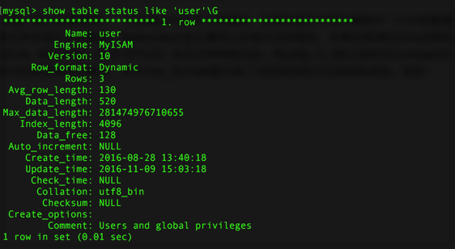
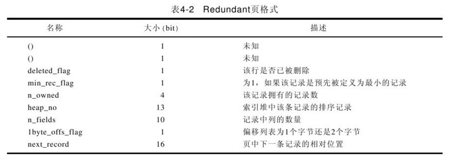
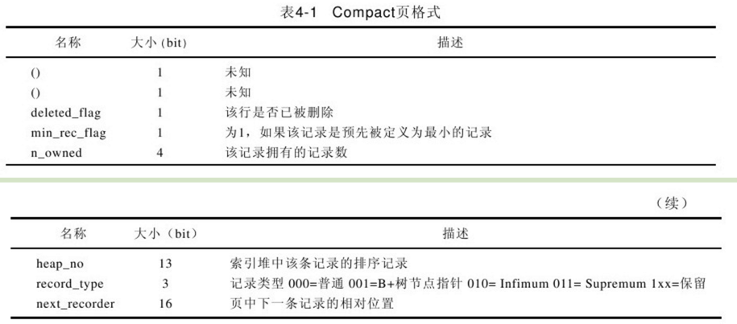
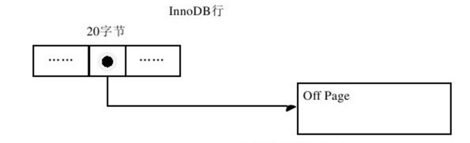

# InnoDB的行记录格式

https://www.cnblogs.com/wade-luffy/p/6289183.html

InnoDB存储引擎和大多数数据库一样，记录是以行的形式存储的，这意味着页中保存着表中一行行的数据。另外MYSQL对每个页存放的记录数又有硬性的规定，最少2行，最多16KB/2 - 200，即7992行。


## 文件格式：

Antelope：InnoDB 1.0.X之前，只支持2种row_format：

```
Redundant、Compact
```

Redundant是mysql5.0版本之前的行记录存储方式，之后仍然支持这个格式是为了兼容之前版本的格式，5.1之后很少用到了，因为Compact的结构设计比它好得多，compact格式消耗的磁盘空间和备份耗时更小，Redundant相比之下大了一些。compact格式更适用于大多数的业务场景。

Barracuda：InnoDB 1.0.X引入，支持4种row_format：

```
Redundant、Compact、Compressed、Dynamic
```

参数innodb_file_format用来指定文件格式，可以通过下面的方式来查看当前所使用的InnoDB存储引擎的文件格式：

```
show variables like 'innodb_file_format';
```

现在基本上都是**Barracuda**。

Dynamic和Compact基本是类似的，但是它们在行溢出数据的处理上却完全不同：

compact格式下，溢出列存储前768字节，而dynamic格式下，溢出的列只存储前20字节，一旦发生了行溢出，dynamic其实就存储一个指针，数据都放在溢出页里，dynamic代表将长字段(发生行溢出)完全off-page存储。

## 行记录格式

通过命令SHOW TABLE STATUS LIKE 'table_name'来查看当前表使用的行格式，其中row_format就代表了当前使用的行记录结构类型。例如：

use mysql;

show table status like 'user'\G



如果我们知道规则，可以读取其中的记录，如py_innodb_page_info工具。

### Redundant行记录格式(5.0前老版本)

Redundant是MySQL 5.0版本之前InnoDB的行记录存储方式，MySQL 5.0支持Redundant是为了向前兼容性。Redundant行记录以如下方式存储：


Redundant行格式的首部是一个字段长度偏移列表，同样是按照列的顺序逆序放置的。当列的长度小于255字节，用1字节表示；若大于255个字节，用2个字节表示。第二个部分为记录头信息（record header），Redundant行格式固定占用6个字节（48位），每位的含义见表4-2。从表中可以看到，n_fields值代表一行中列的数量，占用10位，这也很好地解释了为什么MySQL一个行支持最多的列为1023。另一个需要注意的值为1byte_offs_flags，该值定义了偏移列表占用1个字节还是2个字节。最后的部分就是实际存储的每个列的数据了。



创建一张和mytest内容完全一样、但行格式为Redundant的表mytest2

create table mytest2 engine=innodb row_format=redundant as (select * from mytest);

show table status like 'mytest2'\G

select * from mytest2\G

现在row_format变为Redundant。同样，通过hexdump将表空间mytest2.ibd导出到文本文件mytest2.txt。打开文件，找到类似如下行：

```
0000c070 08 03 00 00 73 75 70 72 65 6d 75 6d 00 23 20 16|……supremum.#.
0000c080 14 13 0c 06 00 00 10 0f 00 ba 00 00 00 2b 68 0b|……+h.
0000c090 00 00 00 00 06 53 80 00 00 00 32 01 10 61 62 62|……S……2..abb
0000c0a0 62 62 20 20 20 20 20 20 20 20 63 63 63 23 20 16|bb ccc#.
0000c0b0 14 13 0c 06 00 00 18 0f 00 ea 00 00 00 2b 68 0c|……+h.
0000c0c0 00 00 00 00 06 53 80 00 00 00 32 01 1e 64 65 65|……S……2..dee
0000c0d0 65 65 20 20 20 20 20 20 20 20 66 66 66 21 9e 94|ee fff！..
0000c0e0 14 13 0c 06 00 00 20 0f 00 74 00 00 00 2b 68 0d|……t……+h.
0000c0f0 00 00 00 00 06 53 80 00 00 00 32 01 2c 64 00 00|……S……2.，d..
0000c100 00 00 00 00 00 00 00 00 66 66 66 00 00 00 00 00|……fff……

整理可以得到如下内容：
23 20 16 14 13 0c 06/*长度偏移列表，逆序*/
00 00 10 0f 00 ba/*记录头信息，固定6个字节*/
00 00 00 2b 68 0b/*RowID*/
00 00 00 00 06 53/*TransactionID*/
80 00 00 00 32 01 10/*Roll Point*/
61/*列1数据'a'*/
62 62/*列2数据'bb'*/
62 62 20 20 20 20 20 20 20 20/*列3数据'bb'Char类型*/
63 63 63/*列4数据'ccc'*/
```

23 20 16 14 13 0c 06，逆转为06，0c，13，14，16，20，23。分别代表第一列长度6，第二列长度6（6+6=0x0C），第三列长度为7（6+6+7=0x13），第四列长度1（6+6+7+1=0x14），第五列长度2（6+6+7+1+2=0x16），第六列长度10（6+6+7+1+2+10=0x20），第七列长度3（6+6+7+1+2+10+3=0x23）。

记录头信息中应该注意48位中22～32位，为0000000111，表示表共有7个列（包含了隐藏的3列），接下去的33位为1，代表偏移列表为一个字节。

后面的信息就是实际每行存放的数据了，这与Compact行格式大致相同。

请注意是大致相同，因为如果我们来看第三行，会发现对于NULL的处理两者是不同的。

21 9e 94 14 13 0c 06/*长度偏移列表，逆序*/

00 00 20 0f 00 74/*记录头信息，固定6个字节*/

00 00 00 2b 68 0d/*RowID*/

00 00 00 00 06 53/*TransactionID*/

80 00 00 00 32 01 10/*Roll Point*/

64/*列1数据'a'*/

00 00 00 00 00 00 00 00 00 00/*列3数据NULL*/

66 66 66/*列4数据'fff'*/

这里与之前Compact行格式有着很大的不同了，首先来看长度偏移列表，我们逆序排列后得到06 0c 13 14 94 9e 21，前4个值都很好理解，第5个NULL变为了94，接着第6个列char类型的NULL值为9e（94+10=0x9e），之后的21代表14+3=0x21。可以看到对于**varchar的NULL值，Redundant行格式同样不占用任何存储空间，因而char类型的NULL值需要占用空间**。

当前表mytest2的字符集为Latin1，每个字符最多只占用1个字节。若这里将表mytest2的字符集转换为utf8，第三列char固定长度类型就不再是只占用10个字节了，而是10×3=30个字节，Redundant行格式下char固定字符类型将会占据可能存放的最大值字节数。

### Compact行记录格式(5.0引入)

Compact行记录是在MySQL 5.0时被引入的，其设计目标是能高效存放数据。简单来说，如果一个页中存放的行数据越多，其性能就越高。Compact行记录以如下方式进行存储： 


Compact行格式的首部是一个非NULL变长字段长度列表，而且是按照列的顺序逆序放置的。当列的长度小于255字节，用1字节表示，若大于255个字节，用2个字节表示，变长字段的长度最大不可以超过2个字节（这也很好地解释了为什么MySQL中varchar的最大长度为65 535，因为2个字节为16位，即216=1=65 535）。第二个部分是NULL标志位，该位指示了该行数据中是否有NULL值，用1表示。该部分所占的字节应该为bytes。接下去的部分是为记录头信息（record header），固定占用5个字节（40位），每位的含义见下表4-1。最后的部分就是实际存储的每个列的数据了，需要特别注意的是，NULL不占该部分任何数据，即NULL除了占有NULL标志位，实际存储不占有任何空间。另外有一点需要注意的是，每行数据除了用户定义的列外，还有两个隐藏列，事务ID列和回滚指针列，分别为6个字节和7个字节的大小。若InnoDB表没有定义Primary Key，每行还会增加一个6字节的RowID列。



下面用一个具体事例来分析Compact行记录的内部结构：

create table mytest (

　　t1 varchar(10),

　　t2 varchar(10),

　　t3 char(10),

　　t4 varchar(10)

) engine=innodb charset=latin1 row_format=compact;

insert into mytest values('a','bb','bb','ccc'); 

insert into mytest values('d','ee','ee','fff'); 

insert into mytest values('d',NULL,NULL,'fff'); 

select * from mytest\G; 

创建了mytest表，有4个列，t1、t2、t4都为varchar变长字段类型，t3为固定长度类型char。接着我们插入了3条有代表性的数据，接着打开mytest.ibd（启用了innodb_file_per_table，若你没有启用该选项，请打开默认的共享表空间文件ibdata1）。在Windows下，可以选择用UltraEdit打开该二进制文件（在Linux环境下，使用hexdump -C -v mytest.ibd＞mytest.txt即可），打开mytest.txt文件，找到如下内容： 

```
0000c070 73 75 70 72 65 6d 75 6d 03 02 01 00 00 00 10 00|supremum……
0000c080 2c 00 00 00 2b 68 00 00 00 00 00 06 05 80 00 00|，……+h……
0000c090 00 32 01 10 61 62 62 62 62 20 20 20 20 20 20 20|.2..abbbb
0000c0a0 20 63 63 63 03 02 01 00 00 00 18 00 2b 00 00 00|ccc……+……
0000c0b0 2b 68 01 00 00 00 00 06 06 80 00 00 00 32 01 10|+h……2..
0000c0c0 64 65 65 65 65 20 20 20 20 20 20 20 20 66 66 66|deeeefff
0000c0d0 03 01 06 00 00 20 ff 98 00 00 00 2b 68 02 00 00|……+h……
0000c0e0 00 00 06 07 80 00 00 00 32 01 10 64 66 66 66 00|……2..dfff.
该行记录从0000c078开始，若整理如下，相信你会有更好的理解：
03 02 01/*变长字段长度列表，逆序*/
00/*NULL标志位，第一行没有NULL值*/
00 00 10 00 2c/*记录头信息，固定5字节长度*/
00 00 00 2b 68 00/*RowID我们建的表没有主键，因此会有RowID*/
00 00 00 00 06 05/*TransactionID*/
80 00 00 00 32 01 10/*Roll Pointer*/
61/*列1数据'a'*/
62 62/*列2'bb'*/
62 62 20 20 20 20 20 20 20 20/*列3数据'bb'*/
63 63 63/*列4数据'ccc'*/
```

现在第一行数据就展现在我们眼前了。需要注意的是，变长字段长度列表是逆序存放的，03 02 01，而不是01 02 03。还需要注意的是InnoDB每行有隐藏列。同时可以看到，固定长度char字段在未填充满其长度时，会用0x20来进行填充。再来分析一下，记录头信息的最后4个字节代表next_recorder，0x6800代表下一个记录的偏移量，当前记录的位置+0x6800就是下一条记录的起始位置。所以InnoDB存储引擎在页内部是通过一种链表的结构来串联各个行记录的。

第二行我将不做整理，除了RowID不同外，它和第一行大同小异，有兴趣的读者可以用上面的方法自己试试。

现在我们关注有NULL值的第三行：

03 01/*变长字段长度列表，逆序*/

06/*NULL标志位，第三行有NULL值，6=110

00 00 20 ff 98/*记录头信息*/

00 00 00 2b 68 02/*RowID*/

00 00 00 00 06 07/*TransactionID*/

80 00 00 00 32 01 10/*Roll Pointer*/

64/*列1数据'd'*/

66 66 66/*列4数据'fff'*/

第三行有NULL值，因此NULL标志位不再是00而是06了，转换成二进制为00000110，为1的值即代表了第2列和第3列的数据为NULL，在其后存储列数据的部分，我们会发现没有存储NULL，只存储了第1列和第4列非NULL的值。这个例子很好地说明了：不管是char还是varchar类型，NULL值是不占用存储空间的。

### Compressed与Dynamic行记录格式

新的两种格式对于存放BLOB的数据采用了完全的行溢出的方式，在数据页中只存放20个字节的指针，实际的数据都存放在BLOB Page中，而之前的Compact和Redundant两种格式会存放768个前缀字节。

下图是Barracuda文件格式的溢出行：



Compressed行记录格式的另一个功能就是，存储在其中的行数据会以zlib的算法进行压缩，因此对于BLOB、TEXT、VARCHAR这类大长度类型的数据能进行非常有效的存储。
