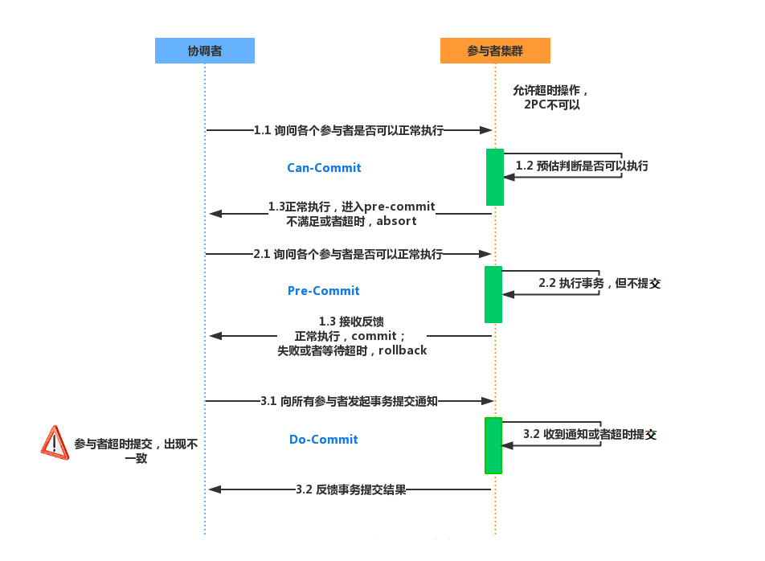

# 2PC与3PC

### 2PC 二阶段提交 协议

 二阶段提交（Two-phase Commit），是指，为了使基于分布式系统架构下的所有节点在进行事务提交时保持一致性而设计的一种算法(Algorithm)。通常，二阶段提交也被称为是一种协议(Protocol)。在分布式系统中，每个节点虽然可以知晓自己的操作时成功或者失败，却无法知道其他节点的操作的成功或失败。当一个事务跨越多个节点时，为了保持事务的ACID特性，需要引入一个作为协调者的组件来统一掌控所有节点(称作参与者)的操作结果并最终指示这些节点是否要把操作结果进行真正的提交(比如将更新后的数据写入磁盘等等)。因此，二阶段提交的算法思路可以概括为： 参与者将操作成败通知协调者，再由协调者根据所有参与者的反馈情报决定各参与者是否要提交操作还是中止操作

二阶段提交算法的成立基于以下假设：

1. 该分布式系统中，存在一个节点作为协调者(Coordinator)，其他节点作为参与者(Cohorts)。且节点之间可以进行网络通信。
2. 所有节点都采用预写式日志，且日志被写入后即被保持在可靠的存储设备上，即使节点损坏不会导致日志数据的消失。
3. 所有节点不会永久性损坏，即使损坏后仍然可以恢复

二阶段提交分为两阶段：第一阶段：投票阶段，第二阶段：提交阶段

**投票阶段 Prepares**

1. 协调者向所有参与者询问是否可以执行提交操作，并开始等待各参与者的响应
2. 参与者执行事务操作，如果执行成功就返回Yes响应，如果执行失败就返回No响应
3. 如果协调者接受参与者响应超时，也会认为执行事务操作失败

**提交阶段 commit**

1. 如果第一阶段汇中所有参与者都返回yes响应，协调者向所有参与者发出提交请求，所有参与者提交事务
2. 如果第一阶段中有一个或者多个参与者返回no响应，协调者向所有参与者发出回滚请求，所有参与者进行回滚操作

二阶段提交优点：尽量保证了数据的强一致，但不是100%一致

缺点：

- 单点故障

  由于协调者的重要性，一旦协调者发生故障，参与者会一直阻塞，尤其时在第二阶段，协调者发生故障，那么所有的参与者都处于锁定事务资源的状态中，而无法继续完成事务操作

- 同步阻塞

  由于所有节点在执行操作时都是同步阻塞的，当参与者占有公共资源时，其他第三方节点访问公共资源不得不处于阻塞状态

- 数据不一致

  在第二阶段中，当协调者想参与者发送提交事务请求之后，发生了局部网络异常或者在发送提交事务请求过程中协调者发生了故障，这会导致只有一部分参与者接收到了提交事务请求。而在这部分参与者接到提交事务请求之后就会执行提交事务操作。但是其他部分未接收到提交事务请求的参与者则无法提交事务。从而导致分布式系统中的数据不一致

**二阶段提交的问题**

 如果协调者在第二阶段发送提交请求之后挂掉，而唯一接受到这条消息的参与者执行之后也挂掉了，即使协调者通过选举协议产生了新的协调者并通知其他参与者进行提交或回滚操作的话，都可能会与这个已经执行的参与者执行的操作不一样，当这个挂掉的参与者恢复之后，就会产生数据不一致的问题

### 3PC 三阶段提交 协议

 三阶段提交（Three-phase commit），三阶段提交是为解决两阶段提交协议|的缺点而设计的。 与两阶段提交不同的是，三阶段提交是“非阻塞”协议。三阶段提交在两阶段提交的第一阶段与第二阶段之间插入了一个准备阶段，使得原先在两阶段提交中，参与者在投票之后，由于协调者发生崩溃或错误，而导致参与者处于无法知晓是否提交或者中止的“不确定状态”所产生的可能相当长的延时的问题得以解决

三阶段提交的三个阶段：CanCommit，PreCommit，DoCommit三个阶段

**询问阶段 CanCommit**

协调者向参与者发送commit请求，参与者如果可以提交就返回Yes响应，否则返回No响应

**准备阶段 PreCommit**

协调者根据参与者在**询问阶段**的响应判断是否执行事务还是中断事务

- 如果所有参与者都返回Yes，则执行事务
- 如果参与者有一个或多个参与者返回No或者超时，则中断事务

参与者执行完操作之后返回ACK响应，同时开始等待最终指令

**提交阶段 DoCommit**

协调者根据参与者在**准备阶段**的响应判断是否执行事务还是中断事务

- 如果所有参与者都返回正确的ACK响应，则提交事务
- 如果参与者有一个或多个参与者收到错误的ACK响应或者超时，则中断事务
- 如果参与者无法及时接收到来自协调者的提交或者中断事务请求时，会在等待超时之后，会继续进行事务提交

协调者收到所有参与者的ACK响应，完成事务

**解决二阶段提交时的问题**

 在三阶段提交中，如果在第三阶段协调者发送提交请求之后挂掉，并且唯一的接受的参与者执行提交操作之后也挂掉了，这时协调者通过选举协议产生了新的协调者，在二阶段提交时存在的问题就是新的协调者不确定已经执行过事务的参与者是执行的提交事务还是中断事务，但是在三阶段提交时，肯定得到了第二阶段的再次确认，那么第二阶段必然是已经正确的执行了事务操作，只等待提交事务了，所以新的协调者可以从第二阶段中分析出应该执行的操作，进行提交或者中断事务操作，这样即使挂掉的参与者恢复过来，数据也是一致的。

 所以，三阶段提交解决了二阶段提交中存在的由于协调者和参与者同时挂掉可能导致的数据一致性问题和单点故障问题，并减少阻塞，因为一旦参与者无法及时收到来自协调者的信息之后，他会默认执行提交事务，而不会一直持有事务资源并处于阻塞状态。

**三阶段提交的问题**

 在**提交阶段**如果发送的是中断事务请求，但是由于网络问题，导致部分参与者没有接到请求，那么参与者会在等待超时之后执行提交事务操作，这样这些由于网络问题导致提交事务的参与者的数据就与接受到中断事务请求的参与者存在数据不一致的问题。

**所以无论是2PC还是3PC都不能保证分布式系统中的数据100%一致**