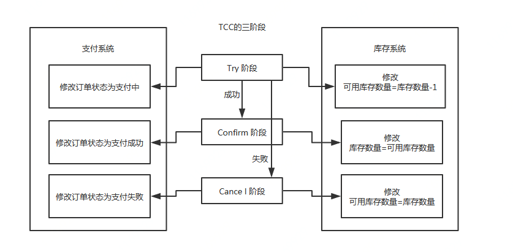

# 分布式事务

#### 本地消息表

本地消息表的核心思想是将分布式事务拆分成本地事务进行处理

以本文中例子，在订单系统新增一条消息表，将新增订单和新增消息放到一个事务里完成，然后通过轮询的方式去查询消息表，将消息推送到mq，库存系统去消费mq

**执行流程：**

1. 订单系统，添加一条订单和一条消息，在一个事务里提交
2. 订单系统，使用定时任务轮询查询状态为未同步的消息表，发送到mq，如果发送失败，就重试发送
3. 库存系统，接收mq消息，修改库存表，需要保证幂等操作
4. 如果修改成功，调用rpc接口修改订单系统消息表的状态为已完成或者直接删除这条消息
5. 如果修改失败，可以不做处理，等待重试

订单系统中的消息有可能由于业务问题会一直重复发送，所以为了避免这种情况可以记录一下 发送次数，当达到次数限制之后报警，人工接入处理；库存系统需要保证幂等，避免同一条消息被多次消费造成数据一致；

本地消息表这种方案实现了最终一致性，需要在业务系统里增加消息表，业务逻辑中多一次插入的DB操作，所以性能会有损耗，而且最终一致性的间隔主要有定时任务的间隔时间决定

#### MQ消息事务

消息事务的原理是将两个事务通过消息中间件进行异步解耦

订单系统执行自己的本地事务，并发送mq消息，库存系统接收消息，执行自己的本地事务，乍一看，好像跟本地消息表的实现方案类似，只是省去 了对本地消息表的操作和轮询发送mq的操作，但实际上两种方案的实现是不一样的

消息事务一定要保证业务操作与消息发送的一致性，如果业务操作成功，这条消息也一定投递成功

消息事务依赖于消息中间件的事务消息，基于消息中间件的二阶段提交实现的，RocketMQ就支持事务消息

**执行流程：**

1. 发送prepare消息到消息中间件
2. 发送成功后，执行本地事务
3. 如果事务执行成功，则commit，消息中间件将消息下发至消费端
4. 如果事务执行失败，则回滚，消息中间件将这条prepare消息删除
5. 消费端接收到消息进行消费，如果消费失败，则不断重试

这种方案也是实现了最终一致性，对比本地消息表实现方案，不需要再建消息表，不再依赖本地数据库事务了，所以这种方案更适用于高并发的场景

#### 最大努力通知

最大努力通知相比前两种方案实现简单，适用于一些最终一致性要求较低的业务，比如支付通知，短信通知这种业务

以支付通知为例，业务系统调用支付平台进行支付，支付平台进行支付，进行操作支付之后支付平台会尽量去通知业务系统支付操作是否成功，但是会有一个最大通知次数，如果超过这个次数后还是通知失败，就不再通知，业务系统自行调用支付平台提供一个查询接口，供业务系统进行查询支付操作是否成功

**执行流程：**

1. 业务系统调用支付平台支付接口， 并在本地进行记录，支付状态为支付中
2. 支付平台进行支付操作之后，无论成功还是失败，都需要给业务系统一个结果通知
3. 如果通知一直失败则根据重试规则进行重试，达到最大通知次数后，不在通知
4. 支付平台提供查询订单支付操作结果接口
5. 业务系统根据一定业务规则去支付平台查询支付结果

这种方案也是实现了最终一致性

#### 补偿事务TCC

TCC Try-Confirm-Cancel的简称，针对每个操作，都需要有一个其对应的确认和取消操作，当操作成功时调用确认操作，当操作失败时调用取消操作，类似于二阶段提交，只不过是这里的提交和回滚是针对业务上的，所以基于TCC实现的分布式事务也可以看做是对业务的一种补偿机制

TCC的三阶段：

1. Try 阶段：对业务系统做检测及资源预留
2. Confirm 阶段：对业务系统做确认提交，Try阶段执行成功并开始执行 Confirm阶段时，默认 Confirm阶段是不会出错的。即：只要Try成功，Confirm一定成功
3. Cancel 阶段：在业务执行错误，需要回滚的状态下执行的业务取消，预留资源释放

在try阶段，是对业务系统进行检查及资源预览，比如订单和存储操作，需要检查库存剩余数量是否够用，并进行预留，预留操作的话就是新建一个可用库存数量字段，Try阶段操作是对这个可用库存数量进行操作

比如下一个订单减一个库存:

**执行流程：**

1. Try阶段：订单系统将当前订单状态设置为支付中，库存系统校验当前剩余库存数量是否大于1，然后将可用库存数量设置为库存剩余数量-1，
2. 如果Try阶段执行成功，执行Confirm 阶段，将订单状态修改为支付成功，库存剩余数量修改为可用库存数量
3. 如果Try阶段执行失败，执行Cancel 阶段，将订单状态修改为支付失败，可用库存数量修改为库存剩余数量

基于TCC实现分布式事务，代码逻辑想对复杂一些，需要将原来的接口的逻辑拆分为：try，confirm ，cancel 三个接口的逻辑

基于TCC实现的分布式事务框架：ByteTCC，tcc-transaction

ByteTCC：https://github.com/liuyangming/ByteTCC

tcc-transaction：https://github.com/changmingxie/tcc-transaction