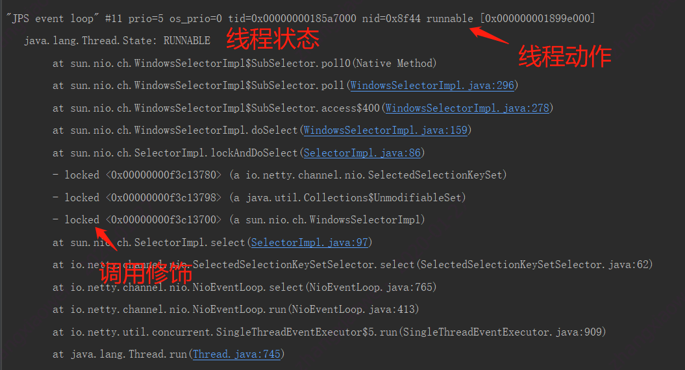
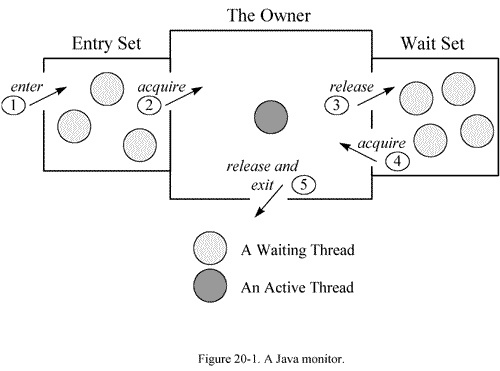

# 线程状态



### 线程状态

- NEW,未启动的。不会出现在Dump中。
- RUNNABLE,在虚拟机内执行的。
- BLOCKED,受阻塞并等待监视器锁。
- WATING,无限期等待另一个线程执行特定操作。
- TIMED_WATING,有时限的等待另一个线程的特定操作。
- TERMINATED,已退出的。

### Monitor

　　在多线程的 JAVA程序中，实现线程之间的同步，就要说说 Monitor。 **Monitor是 Java中用以实现线程之间的互斥与协作的主要手段**，它可以看成是对象或者 Class的锁。每一个对象都有，也仅有一个 monitor。下 面这个图，描述了线程和 Monitor之间关系，以 及线程的状态转换图：



- **进入区(Entrt Set)**:表示线程通过synchronized要求获取对象的锁。如果对象未被锁住,则迚入拥有者;否则则在进入区等待。一旦对象锁被其他线程释放,立即参与竞争。
- **拥有者(The Owner)**:表示某一线程成功竞争到对象锁。
- **等待区(Wait Set)**:表示线程通过对象的wait方法,释放对象的锁,并在等待区等待被唤醒。

　　从图中可以看出，一个 Monitor在某个时刻，只能被一个线程拥有，该线程就是 “Active Thread”，而其它线程都是 “Waiting Thread”，分别在两个队列 “ Entry Set”和 “Wait Set”里面等候。在 “Entry Set”中等待的线程状态是 “Waiting for monitor entry”，而在 “Wait Set”中等待的线程状态是 “in Object.wait()”。 先看 “Entry Set”里面的线程。我们称被 synchronized保护起来的代码段为临界区。当一个线程申请进入临界区时，它就进入了 “Entry Set”队列。对应的 code就像：

```
synchronized(obj) {
.........

}
```

###  

### 调用修饰

表示线程在方法调用时,额外的重要的操作。线程Dump分析的重要信息。修饰上方的方法调用。

- locked <地址> 目标：使用synchronized申请对象锁成功,监视器的拥有者。
- waiting to lock <地址> 目标：使用synchronized申请对象锁未成功,在迚入区等待。
- waiting on <地址> 目标：使用synchronized申请对象锁成功后,释放锁幵在等待区等待。
- parking to wait for <地址> 目标

###  

### 线程动作

线程状态产生的原因

- runnable:状态一般为RUNNABLE。
- in Object.wait():等待区等待,状态为WAITING或TIMED_WAITING。
- waiting for monitor entry:进入区等待,状态为BLOCKED。
- waiting on condition:等待区等待、被park。
- sleeping:休眠的线程,调用了Thread.sleep()。

##  

### 线程Dump的分析案例

#### **持续运行的IO**

 IO操作是可以以RUNNABLE状态达成阻塞。例如:数据库死锁、网络读写。 格外注意对IO线程的真实状态的分析。 一般来说,被捕捉到RUNNABLE的IO调用,都是有问题的。 以下堆栈显示： 线程状态为RUNNABLE。 调用栈在SocketInputStream或SocketImpl上,socketRead0等方法。 调用栈包含了jdbc相关的包。很可能发生了数据库死锁

```
"d&a-614" daemon prio=6 tid=0x0000000022f1f000 nid=0x37c8 runnable
[0x0000000027cbd000]
java.lang.Thread.State: RUNNABLE
at java.net.SocketInputStream.socketRead0(Native Method)
at java.net.SocketInputStream.read(Unknown Source)
at oracle.net.ns.Packet.receive(Packet.java:240)
at oracle.net.ns.DataPacket.receive(DataPacket.java:92)
at oracle.net.ns.NetInputStream.getNextPacket(NetInputStream.java:172)
at oracle.net.ns.NetInputStream.read(NetInputStream.java:117)
at oracle.jdbc.driver.T4CMAREngine.unmarshalUB1(T4CMAREngine.java:1034)
at oracle.jdbc.driver.T4C8Oall.receive(T4C8Oall.java:588)
```

#### 分线程调度的休眠

正常的线程池等待

```
"d&a-131" in Object.wait()
java.lang.Thread.State: TIMED_WAITING (on object monitor)
at java.lang.Object.wait(Native Method)
at com.jiuqi.dna.core.impl.WorkingManager.getWorkToDo(WorkingManager.java:322)
- locked <0x0000000313f656f8> (a com.jiuqi.dna.core.impl.WorkingThread)
at com.jiuqi.dna.core.impl.WorkingThread.run(WorkingThread.java:40)
```

可疑的线程等待

```
"d&a-121" in Object.wait()
java.lang.Thread.State: WAITING (on object monitor)
at java.lang.Object.wait(Native Method)
at java.lang.Object.wait(Object.java:485)
at com.jiuqi.dna.core.impl.AcquirableAccessor.exclusive()
- locked <0x00000003011678d8> (a com.jiuqi.dna.core.impl.CacheGroup)
at com.jiuqi.dna.core.impl.Transaction.lock()
```