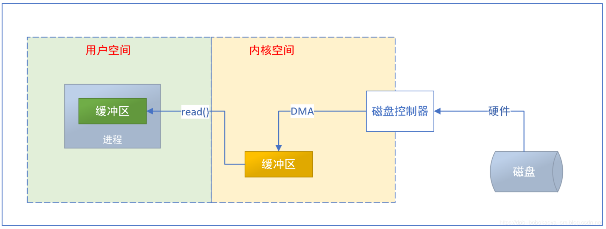
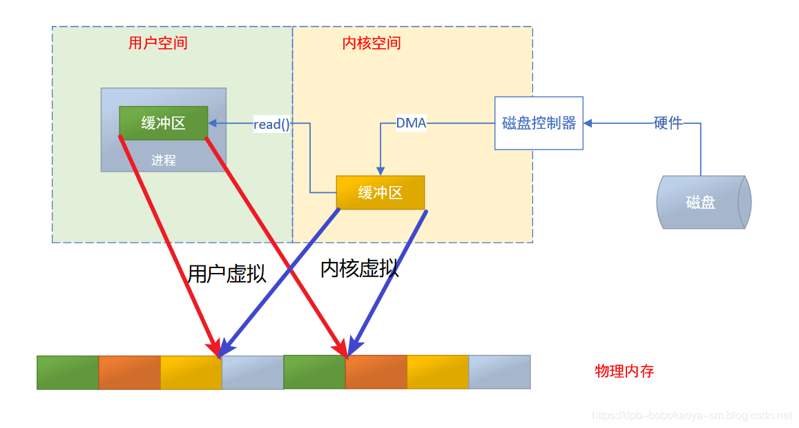
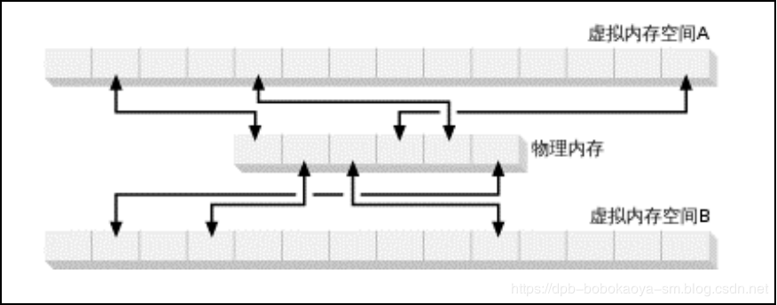
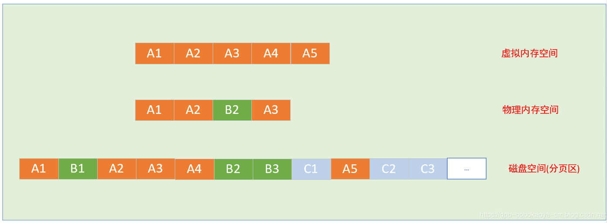
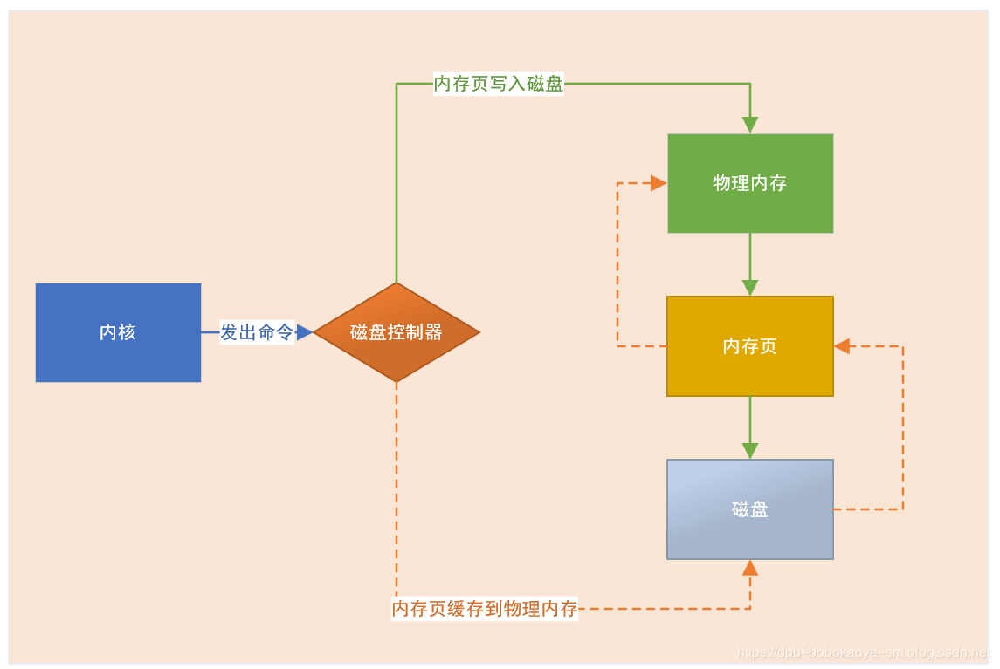
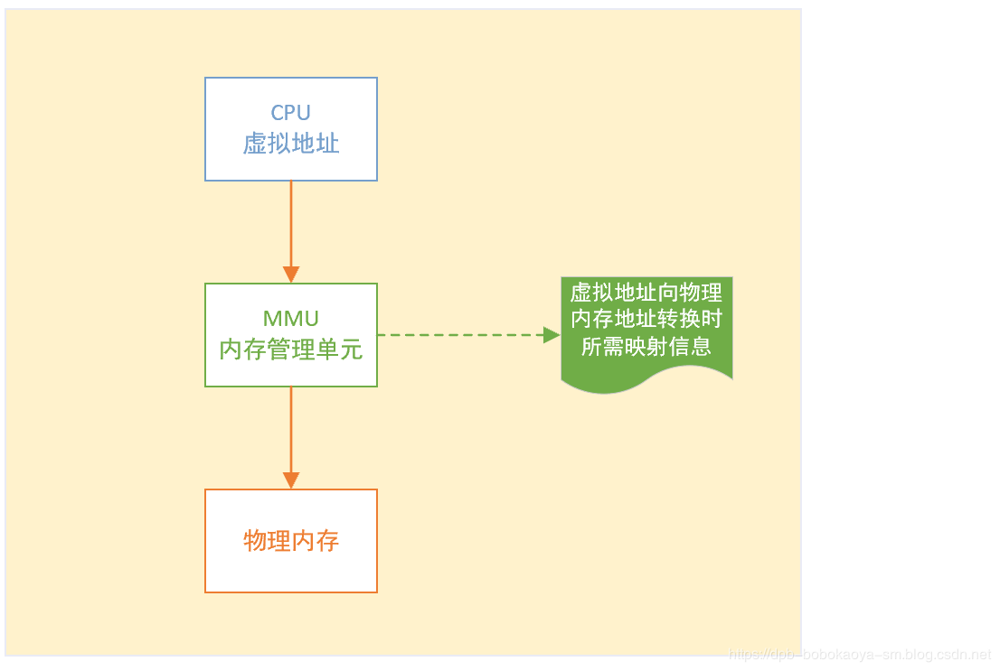

# Java文件读写原理和虚拟内存

https://www.cnblogs.com/myseries/p/12056078.html

### 1.普通IO操作

  根据上图，当进程请求一个I/O操作，它会执行一个系统(open() , read() , writer() , close())调用将控制权移交给内核。当内核以这种方式被调用，它随即采取任何必要步骤，找到进程所需数据，并把数据传送到用户空间内指定的缓冲区中，这时常规进程就可以对缓冲区中的数据处理操作了，而内核试图对数据进行高速缓存或预读取，因此进程所需数据可能已经在内核空间里了，如果是这样，该数据只需简单地拷贝出来即可，如果数据不在内核空间，则进程被挂起，内核着手把数据读进内场。

#### 问题

  数据从内核空间拷贝到用户空间似乎多余，为什么不直接让磁盘把数据送到用户空间的缓冲区呢？

1. 硬盘通常不能直接访问用户空间
2. 磁盘基于块存储的硬件设备操作的固定大小的数据块，用户进程请求的可能是任意大小或者非对齐的数据块，在这两者数据交互过程中内核负责数据的分解、再组合工作，起到一个中间人的角色。

### 2.虚拟内存

  通过上面的介绍，我们知道当应用程序需要读取文件的时候，内核首先通过DMA技术将文件内容从磁盘读入内核中的buffer，然后Java应用进程再从内核的buffer将数据读取到应用程序的buffer。也就是有两次的文件复制，为了提升I/O效率和处理能力，操作系统采用**虚拟内存**的机制。虚拟内存意为使用虚假（或虚拟）地址取代物理（硬件RAM）内存地址。这样做好处颇多，总结起来可分为两大类：

1. 一个以上的虚拟地址可指向同一个物理内存地址。
2. 虚拟内存空间可大于实际可用的硬件内存

  这样做的好处是省去了内核与用户空间的往来拷贝。

#### 2.1 一个以上的虚拟地址可指向同一个物理内存地址

  在进行IO操作时就可以将用户空间的buffer区和内核空间的buffer区指向同一个物理内存。这样用户空间的程序就不需要再去内核空间再取回数据，而是可以直接访问，节省内存空间。

#### 2.2 虚拟内存空间可大于实际可用的硬件内存

  当用户程序访问内存地址时，一般的操作如下：首先虚拟内存系统会到物理内存去查找该虚拟地址是否存在。如果存在，如A1，则直接从物理内存中读取;如果不存在,如A4则会抛出一个信号。这时虚拟内存系统会去磁盘空间中找，找到后再按一定的策略，将其置入到内存中，如将B2和A4交换。然后由用户程序就可以使用A4中的数据。这样就保证了用户程序可以读取一些大型的文件。

  从本质上说，物理内存充当了分页区的高速缓存；而所谓分页区，即从物理内存置换出来，转而存储于磁盘上的内存页面.

  把内存页大小设定为磁盘块大小的倍数，这样内核就可直接向磁盘控制硬件发布命令，把内存页写入磁盘，在需要时再重新装入。结果是，所有磁盘 I/O 都在页层面完成。对于采用分页技术的,现代操作系统而言，这也是**数据在磁盘与物理内存之间往来的唯一方式**

#### 2.3内存管理单元

  现代 CPU 包含一个称为内存管理单元（MMU）的子系统，逻辑上位于**CPU 与物理内存之间**。该设备包含虚拟地址向物理内存地址转换时所需映射信息。当 CPU 引用某内存地址时，MMU负责确定该地址所在页（往往通过对地址值进行移位或屏蔽位操作实现），并将虚拟页号转换为物理页号（这一步由硬件完成，速度极快）。如果当前不存在与该虚拟页形成有效映射的物理内存页，MMU会向CPU 提交一个页错误。

  页错误随即产生一个陷阱（类似于系统调用），把控制权移交给内核，附带导致错误的虚拟地址信息，然后内核采取步骤验证页的有效性。内核会安排页面调入操作，把缺失的页内容读回物理内存。这往往导致别的页被移出物理内存，好给新来的页让地方。在这种情况下，如果待移出的页已经被碰过了（自创建或上次页面调入以来，内容已发生改变），还必须首先执行页面调出，把页内容拷贝到磁盘上的分页区。   

　　如果所要求的地址不是有效的虚拟内存地址（不属于正在执行的进程的任何一个内存段），则该页不能通过验证，段错误随即产生。于是，控制权转交给内核的另一部分，通常导致的结果就是进程被强令关闭。   

　　一旦出错的页通过了验证，MMU 随即更新，建立新的虚拟到物理的映射（如有必要，中断被移出页的映射）,用户进程得以继续。造成页错误的用户进程对此不会有丝毫察觉，一切都在不知不觉中进行

 