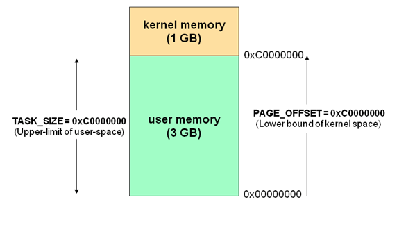
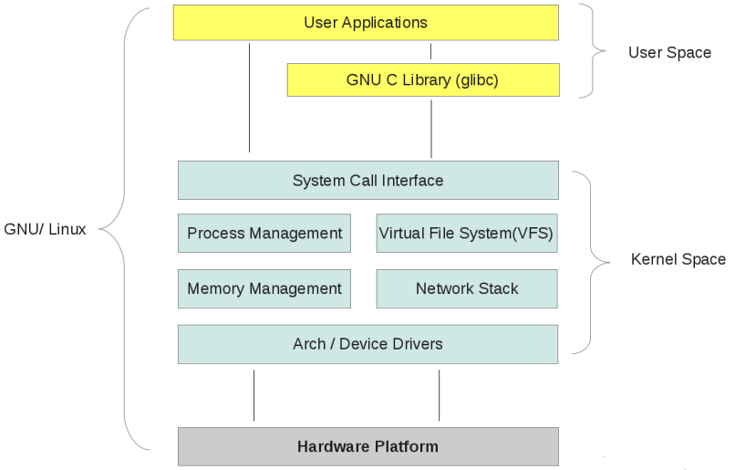
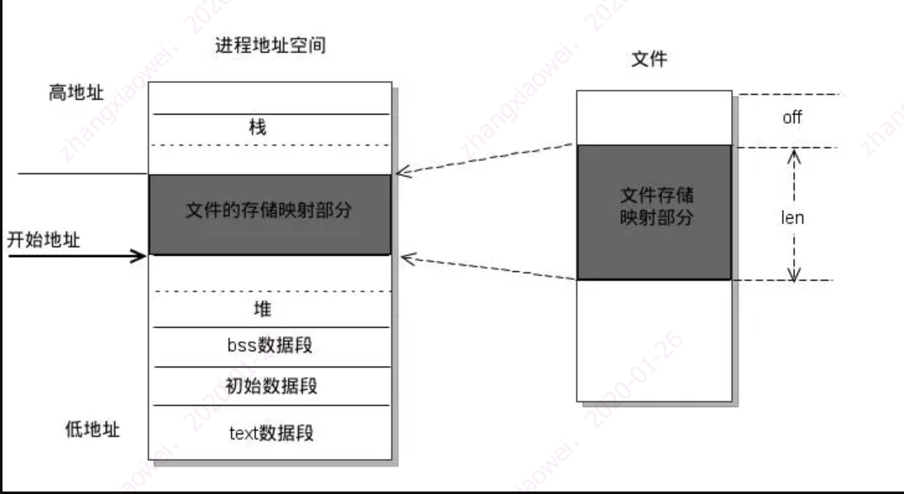
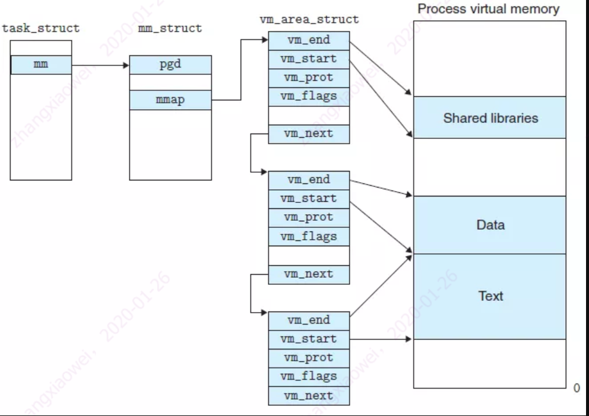

# 用户空间、内核空间以及内存映射

https://www.cnblogs.com/myseries/p/12056078.html

### 内核空间和用户空间

  现代操作系统采用虚拟存储器，对于32位操作系统而言，它的寻址空间（虚拟存储空间）为4G（2的32次方）。操作系统的核心是内核，独立于普通的应用程序，可以访问受保护的内存空间，也有访问底层硬件设备的权限。为了保证用户进程不能直接操作内核，保证内核安全，操作系统将虚拟空间划分为两部分，一部分是内核空间，一部分是用户空间。针对Linux操作系统，将最高的1G字节（从虚拟地址0xC0000000到0xFFFFFFFF）供内核使用，称为内核空间，而较低的3G字节（从虚拟地址0x00000000到0xBFFFFFFF），供各个进程使用，称为用户空间。每个进程都可以通过系统调用进入到内核。其中在Linux系统中，进程的用户空间是独立的，而内核空间是共有的，进程切换时，用户空间切换，内核空间不变。



  有了用户空间和内核空间的划分后，整个linux内部结构可以分为三部分，从最底层到最上层依次是：硬件->内核空间->用户空间，如下图所示:



### 用户态和内核态

  当一个进程执行系统调用而陷入内核代码中执行时，称进行处于内核运行态（内核态）。此时处理器处于特权级别最高的（0级）内核代码中执行。当进程处于内核态时，执行的内核代码会使用当前进程的内核栈。每个进程都有自己的内核栈。

  当进行在执行用户自己的代码时，则称其处于用户运行态（用户态）。此时处理器在特权级最低的（3级）用户代码中运行。当正在执行用户程序而突然被中断程序中断时，此时用户程序也可象征性的称为处于进行的内核态，因为中断处理程序使用当前进程的内核栈。

### 逻辑地址、线性地址和物理地址

  在解释高端内存和内存映射前，先复习一下什么是逻辑地址、线性地址和物理地址吧，大家要是知道的话就可以直接跳过。

#### 逻辑地址

  逻辑地址（Logical Address） 是指由程序产生的和段相关的偏移地址部分。例如，你在进行C语言指针编程中，能读取指针变量本身值(&操作)，实际上这个值就是逻辑地址，他是相对于你当前进程数据段的地址，不和绝对物理地址相干。只有在Intel实模式下，逻辑地址才和物理地址相等（因为实模式没有分段或分页机制,Cpu不进行自动地址转换）；逻辑也就是在Intel保护模式下程序执行代码段限长内的偏移地址（假定代码段、数据段如果完全相同）。应用程式员仅需和逻辑地址打交道，而分段和分页机制对你来说是完全透明的，仅由系统编程人员涉及。应用程式员虽然自己能直接操作内存，那也只能在操作系统给你分配的内存段操作。

#### 线性地址

　　线性地址（Linear Address） 是逻辑地址到物理地址变换之间的中间层。程式代码会产生逻辑地址，或说是段中的偏移地址，加上相应段的基地址就生成了一个线性地址。如果启用了分页机制，那么线性地址能再经变换以产生一个物理地址。若没有启用分页机制，那么线性地址直接就是物理地址。Intel 80386的线性地址空间容量为4G（2的32次方即32根地址总线寻址）。

#### 物理地址

　　物理地址（Physical Address） 是指出目前CPU外部地址总线上的寻址物理内存的地址信号，是地址变换的最终结果地址。如果启用了分页机制，那么线性地址会使用页目录和页表中的项变换成物理地址。如果没有启用分页机制，那么线性地址就直接成为物理地址了。

#### 虚拟地址

  虚拟内存（Virtual Memory）是指计算机呈现出要比实际拥有的内存大得多的内存量。因此他允许程式员编制并运行比实际系统拥有的内存大得多的程式。这使得许多大型项目也能够在具有有限内存资源的系统上实现。一个非常恰当的比喻是：你不必非常长的轨道就能让一列火车从上海开到北京。你只需要足够长的铁轨（比如说3公里）就能完成这个任务。采取的方法是把后面的铁轨即时铺到火车的前面，只要你的操作足够快并能满足需求，列车就能象在一条完整的轨道上运行。这也就是虚拟内存管理需要完成的任务。在Linux0.11内核中，给每个程式（进程）都划分了总容量为64MB的虚拟内存空间。因此程式的逻辑地址范围是0x0000000到0x4000000。有时我们也把逻辑地址称为 虚拟地址。因为和虚拟内存空间的概念类似，逻辑地址也是和实际物理内存容量无关的。逻辑地址和物理地址的“差距”是0xC0000000，是由于虚拟地址->线性地址->物理地址映射正好差这个值。这个值是由操作系统指定的。机理 逻辑地址（或称为虚拟地址）到线性地址是由CPU的段机制自动转换的。如果没有开启分页管理，则线性地址就是物理地址。如果开启了分页管理，那么系统程式需要参和线性地址到物理地址的转换过程。具体是通过设置页目录表和页表项进行的。

### 高端内存

#### 高端内存的由来

  在传统的Linux x86 32位系统中，内核模块的代码或者线程访问内存时，代码中的内存地址都为逻辑地址，而对应到真正的物理内存地址时，还需要地址的一一映射。如果逻辑地址位0xC0000003，那么对应的物理地址就是0x3，如果逻辑地址位0xC0000004，那么对应的物理地址就是0x4，所以物理地址和逻辑地址的关系如下：

```
物理地址 = 逻辑地址 – 0xC0000000
```

  根据上面的内核地址空间的地址转换关系，注意内核的虚拟地址在“高端”，但是ta映射的物理内存地址在低端。会发现，内核模块能够访问的逻辑地址为0xC0000000-0xFFFFFFFF，对应的物理地址为0x00000000-0x40000000，总共1G的内存。也就是说如果计算机的总物理内存大于1G，按照上面的映射关系，高于1G的部分，内核就无法访问到了。为了解决这种状况，就出现了高端内存一说。

  因为不能直接将内和空间的1G内存直接做一一映射，所以Linux内核将内核空间分成了三个部分，分别是：ZONE_DMA，ZONE_NORMAL和ZONE_HIGHMEM。这三个区域的内存分配情况如下：

| ZONE_DMA     | 内存开始的16MB空间 |
| ------------ | ------------------ |
| ZONE_NORMAL  | 16MB-896MB         |
| ZONE_HIGHMEM | 896MB-结束(1G)     |

#### 对高端内存的理解

  上一小节就说到高端内存是用来解决内核无法访问大于1G内存地址空间的问题的。那么具体是怎么实现的呢？总的来说非常简单，当内核需要访问高于1G的内存空间的时候，例如内核需要访问0x50000000-0x500FFFFF这1MB内存空间的时候，只需要在ZONE_HIGHMEM这一个区域内临时申请一个1MB的内存空间，然后将其映射到上述需要访问的内存区域即可。当内核使用完后，释放申请的1MB内存空间便完成对高于1G内存空间的访问了。

### 内存映射（mmap）

#### mmap基本概念

  mmap是一种内存映射文件的方法，即将一个文件或者其它对象映射到进程的地址空间，实现文件磁盘地址和进程虚拟地址空间中一段虚拟地址的一一对映关系。实现这样的映射关系后，进程就可以采用指针的方式读写操作这一段内存，而系统会自动回写脏页面到对应的文件磁盘上，即完成了对文件的操作而不必再调用read,write等系统调用函数。相反，内核空间对这段区域的修改也直接反映用户空间，从而可以实现不同进程间的文件共享。如下图所示：



  由上图可以看出，进程的虚拟地址空间，由多个虚拟内存区域构成。虚拟内存区域是进程的虚拟地址空间中的一个同质区间，即具有同样特性的连续地址范围。上图中所示的text数据段（代码段）、初始数据段、BSS数据段、堆、栈和内存映射，都是一个独立的虚拟内存区域。而为内存映射服务的地址空间处在堆栈之间的空余部分。

  linux内核使用vm_area_struct结构来表示一个独立的虚拟内存区域，由于每个不同质的虚拟内存区域功能和内部机制都不同，因此一个进程使用多个vm_area_struct结构来分别表示不同类型的虚拟内存区域。各个vm_area_struct结构使用链表或者树形结构链接，方便进程快速访问，如下图所示：



  vm_area_struct结构中包含区域起始和终止地址以及其他相关信息，同时也包含一个vm_ops指针，其内部可引出所有针对这个区域可以使用的系统调用函数。这样，进程对某一虚拟内存区域的任何操作需要用要的信息，都可以从vm_area_struct中获得。mmap函数就是要创建一个新的vm_area_struct结构，并将其与文件的物理磁盘地址相连。具体步骤请看下一节。

#### mmap内存映射原理

mmap内存映射的实现过程，总的来说可以分为三个阶段：

进程启动映射过程，并在虚拟地址空间中为映射创建虚拟映射区域

- 进程在用户空间调用库函数mmap，原型：void *mmap(void* start, size_t length, int prot, int flags, int fd, off_t offset);
- 在当前进程的虚拟地址空间中，寻找一段空闲的满足要求的连续的虚拟地址
- 为此虚拟区分配一个vm_area_struct结构，接着对这个结构的各个域进行了初始化
- 将新建的虚拟区结构（vm_area_struct）插入进程的虚拟地址区域链表或树中

调用内核空间的系统调用函数mmap（不同于用户空间函数），实现文件物理地址和进程虚拟地址的一一映射关系

- 为映射分配了新的虚拟地址区域后，通过待映射的文件指针，在文件描述符表中找到对应的文件描述符，通过文件描述符，链接到内核“已打开文件集”中该文件的文件结构体（struct file），每个文件结构体维护着和这个已打开文件相关各项信息。
- 通过该文件的文件结构体，链接到file_operations模块，调用内核函数mmap，其原型为：int mmap(struct file *filp, struct vm_area_struct* vma)，不同于用户空间库函数。
- 内核mmap函数通过虚拟文件系统inode模块定位到文件磁盘物理地址。
- 通过remap_pfn_range函数建立页表，即实现了文件地址和虚拟地址区域的映射关系。此时，这片虚拟地址并没有任何数据关联到主存中。

进程发起对这片映射空间的访问，引发缺页异常，实现文件内容到物理内存（主存）的拷贝

注：前两个阶段仅在于创建虚拟区间并完成地址映射，但是并没有将任何文件数据的拷贝至主存。真正的文件读取是当进程发起读或写操作时。

- 程的读或写操作访问虚拟地址空间这一段映射地址，通过查询页表，发现这一段地址并不在物理页面上。因为目前只建立了地址映射，真正的硬盘数据还没有拷贝到内存中，因此引发缺页异常。
- 缺页异常进行一系列判断，确定无非法操作后，内核发起请求调页过程。
- 调页过程先在交换缓存空间（swap cache）中寻找需要访问的内存页，如果没有则调用nopage函数把所缺的页从磁盘装入到主存中。
- 之后进程即可对这片主存进行读或者写的操作，如果写操作改变了其内容，一定时间后系统会自动回写脏页面到对应磁盘地址，也即完成了写入到文件的过程。

注：修改过的脏页面并不会立即更新回文件中，而是有一段时间的延迟，可以调用msync()来强制同步, 这样所写的内容就能立即保存到文件里了。

 

### vm_struct和vm_area_struct

  关于vm_struct和vm_area_struct这两个结构体，需要简单说明一下，vm_struct和vm_area_struct都是用于表示一片连续的虚拟地址空间的，但是映射到物理地址空间后可以是不连续的。其次，vm_area_struct表示的虚拟地址是给进程使用的，而vm_struct表示的虚拟地址是给内核使用的。从上面的内容可以知道，内核空间的地址分成三个部分，ZONE_DMA、ZONE_NORMAL和ZONE_HIGHMEM，其中前面两部分是用来和物理地址进行一一映射的，而ZONE_HIGHMEM通过临时借用以及映射的方法管理高于1G的内存，vm_struct所使用的内核虚拟地址就是ZONE_HIGHMEM部分地址。