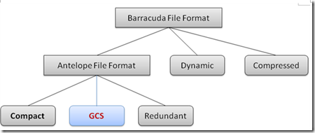
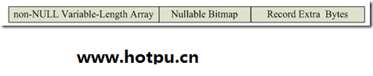
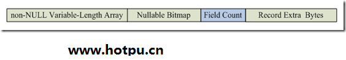

# MySQL数据库InnoDB存储引擎在线加字段实现原理详解

http://www.zhdba.com/mysqlops/2013/09/14/mysql-innodb-online-ddl/

腾讯互娱内部维护了一个MySQL分支，基于官方5.5.24，实现了类似于Oracle 11g的快速加字段功能，这个分支我们内部称为TMySQL。该功能通过扩展存储格式来实现，原理类似于Oracle 11g，以下介绍下其实现原理。

1. **GCS行格式**

需要在innodb中实现类似oracle的快速加字段功能，仅仅基于原来的行格式是不行的，必须对其进行扩展。为了保证原MySQL和innodb的兼容性，不改变原存储格式的行为，在线加字段功能是通过新增一种innodb行格式GCS（Game Cloud Storage）来实现，从而避免对其他格式造成影响。



虽然说是新增格式，但该格式与原默认的compact是基本一样的，只是新增了关键的Field Count（字段数）控制信息。

下面先回顾下compact行格式

compact聚集索引记录的格式由下图所示，由记录头和记录内容组成。


记录头记录了解析字段的关键信息，其结构下图所示。



Record Extra Bytes：是固定的5字节，表示记录的额外信息。

Nullable Bitmap：记录可空位图，使用1个bit来表示一个可空字段是否为NULL。

non-NULL Variable-Length Array：非空变长字段数组，表示非空变长字段（如varchar、varbinary）在该行的长度。

关于Compact格式的详细介绍可以参考文章。

compact格式有很重要的两个特点：

字段的定义顺序与存储顺序基本一致（主键除外）
字段为NULL不占存储空间，只需通过Nullable Bitmap记录。

基于以上特点，实现快速加字段功能GCS格式只需在记录头添加Field Count（字段数），来表示当前记录的字段数，占用1~2字节（若大于127，则使用2字节）。



那么，解析GCS记录的关键逻辑就变为：

假设某GCS记录的Field count记录为x，表字段数为y，那么x <= y总是成立的。对于GCS格式，字段的解析变为：

如果x == y或非GCS格式，按原来compact方式解析
如果x < y，那么记录必定是在Alter Table加字段前就生成，那么最后y-x个字段必为NULL或默认值。 如果该字段是允许为NULL，则为NULL。 如果该字段不允许为NULL，则为默认值。 这样就可以将新增的字段解析出来。 另外，GCS格式在TMySQL中会替代compact作为innodb的默认行格式。

```
 mysql> create table t1(c1 int, c2 int);
Query OK, 0 rows affected (0.00 sec)

mysql> show table status like 't1'G
*************************** 1. row ***************************
Name: t1
Engine: InnoDB
Version: 10
Row_format: Gcs
Rows: 0
Avg_row_length: 0
Data_length: 16384
Max_data_length: 0
Index_length: 0
Data_free: 0
Auto_increment: NULL
Create_time: 2013-09-10 11:44:21
Update_time: NULL
Check_time: NULL
Collation: utf8_general_ci
Checksum: NULL
Create_options:
Comment:
1 row in set (0.00 sec)
```

\# 插入大量数据

```
mysql> insert into t1 values(1,1);
Query OK, 1 row affected (0.00 sec)
```

\# 快速加字段

```
mysql> alter table t1 add column d1 int not null default 0, add column d2 int;
Query OK, 0 rows affected (0.00 sec)
Records: 0 Duplicates: 0 Warnings: 0

mysql> select * from t1 limit 1;
+------+------+----+------+
| c1 | c2 | d1 | d2 |
+------+------+----+------+
|1 |1 | 0 | NULL |
+------+------+----+------+
1 row in set (0.00 sec)
```

2. **兼容性**

仅仅新增GCS存储格式，必定导致原来数据的不兼容（每行增加Field Count），只能通过重导数据或alter table来使其支持在线加字段功能。

\# compact格式转换为GCS格式
mysql> alter table t_compact row_format=gcs;

如果数据量越大，上述语句所花时间就会越长，这样对升级和使用都带来困难。

为了解决这个问题，GCS格式实现了对compact格式的全面兼容。

在innodb实现中，compact格式记录头的Record Extra Bytes首字节最高位和次高位是保留的，总是为0。因此，GCS记录占用了其中的最高bit，若为1表示使用GCS格式，记录中会包含Field count信息，这里称该bit为控制位。

然而GCS行格式新增的Field Count仅仅是为了表示记录的字段数，如果表不执行加字段操作，该部分其实是不起作用的（记录字段数恒等于表字段数）。换句话说，如果GCS表不执行快速加字段操作，记录其实并不需要存储Field Count信息。

因此，当表第一次快速加字段前，GCS记录可以与compact完全相同，即控制位为0；当第一次快速加字段时，可将加字段前的字段数存储在扩展的数据字典中，用来解析控制位为0的GCS记录(充当记录上的field count信息)；新插入或修改的记录，则按照第一节介绍的存储格式进行构建。

最后，这个设计中的GCS记录在第一次快速加字段前可以跟Compact格式是完全一致的。这样做，有两个好处：

第一次在线加字段前，减少每条GCS记录Field Count 1~2字节的存储消耗
可以支持Compact表快速转换为GCS表，实现快速升级

由于存储格式完全兼容，不管原来的compact表数据量有多少，仅需执行以下命令，修改表的元数据信息，就能将格式快速转换为GCS，从而获得快速加字段功能。

mysql> create table t_compact(c1 int, c2 int) row_format=compact;
Query OK, 0 rows affected (0.00 sec)

mysql> insert into t_compact values(1,1);
Query OK, 1 row affected (0.00 sec)

\# compact格式非onlie操作，需要拷贝数据
mysql> alter table t_compact add column d1 int;
Query OK, 1 row affected (0.01 sec)
Records: 1 Duplicates: 0 Warnings: 0

\# online操作，只需修改元数据，不需拷贝数据
mysql> alter table t_compact row_format = gcs;
Query OK, 0 rows affected (0.00 sec)
Records: 0 Duplicates: 0 Warnings: 0

\# online操作
mysql> alter table t_compact add column d2 int not null default 0;
Query OK, 0 rows affected (0.00 sec)
Records: 0 Duplicates: 0 Warnings: 0

这样，TMySQL可实现基于5.5的覆盖升级，对于compact表只需执行alter table row_format = gcs命令就能快速支持在线加字段功能，大大降低升级成本，并且实现加字段前没有存储空间的额外消耗！
**3 DML操作**

存储格式得以支持，相应的DML操作逻辑需要修改。

select：按照GCS格式进行解析
insert：根据当前表的字段数构造记录中field count和标记控制位
delete：不变
update：原地更新不变；非原地更新走delete+insert，会更新为新的field count

**4 数据字典**

InnoDB存储引擎关于列的数据字典中并不包含默认值信息，默认值只存储在MySQL层的frm文件中。

为了支持默认值的加字段操作，InnoDB存储引擎层需要存储新增列的默认值信息。一种办法是在原SYS_COLUMNS系统表增加def_val列，表示默认值。但这必定导致TMySQL和官方版本的不兼容，并且不是所有列的默认值都需要存储的，只需保存新增列的默认值信息。

因此，TMySQL新增一个系统表SYS_ADDED_COLS_DEFAULT，保存新增列的默认值，并通过(tableid,pos)与SYS_COLUMNS的列信息关联起来。

SYS_ADDED_COLS_DEFAULT(
tableid bigint,
pos int,
def_val binary(65535),
def_val_len int,
Primary key (tableid, pos)
);

为了实现与官方版本兼容，SYS_ADDED_COLS_DEFAULT使用动态创建功能，即TMySQL启动加载数据字典子系统时发现该表不存在，会动态创建。这样，从官方版本升级原地升级为TMySQL时就不需考虑该表导致的不兼容问题。

除了默认值，systables系统表还需记录GCS格式标记，第一次加字段前字段数等新增元数据信息。
**5 加字段流程**

MySQL官方版本加字段其实是新建表导入数据，并删除原表的过程，整个过程是阻塞写的。

而TMySQL的GCS格式支持原数据不改变的情况下解析新增字段，并且可以在原表上直接修改元数据，不需拷贝数据，从而实现加字段时间可以大大缩短。

GCS表在线加字段的过程为：

目标表T1上字典锁（SHARED_NO_WRITE）,阻塞所有写操作
判断是否符合在线加字段的条件，如符合，执行步骤3，否则按照官方拷贝数据的方式来新增字段。
创建跟目标表T1同构的临时表frm文件S1.frm（含新增字段）
目标表T1的字典锁升级为排它锁，所有关于T1表的所有读写操作被阻塞
修改T1表InnoDB存储引擎内部数据字典信息，增加新字段。
将S1.frm重命名为T1.frm
释放表T1的字典锁

以上流程处理参考了5.6 online DDL的部分实现。

TMySQL并不支持任何情况的加字段操作，必须符合以下条件：

表必须是innodb存储引擎的GCS表，原Compact表不支持在线加字段功能。
不支持临时表。
一次alter table仅允许加一列或多列，但不允许同时进行多个alter table的不同操作（如增删索引、删字段、修改字段等）。
加字段不支持指定Before或After关键字表示定义在某列之前或之后。
所加字段不能包含除not null外的任何约束，包括外键约束、唯一约束。
不支持允许为NULL并指定默认值的加字段操作（同oracle 11g)
所加字段不能自增列(auto_increment)

**6 总结**

以上是TMySQL在线加字段操作的实现原理，除了以上内容还包括语法、故障恢复、事务回滚、自适应哈希索引等适配改造，比较细节，这里就先不介绍了。对以上有任何疑问，欢迎讨论~

除了在线加字段，TMySQL还有不少其他新特性，后续再介绍了。