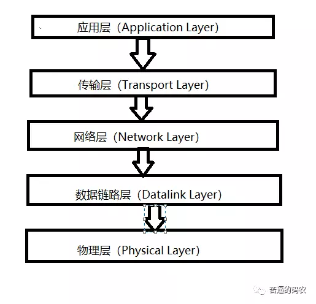
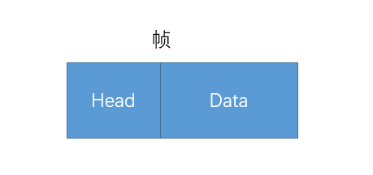
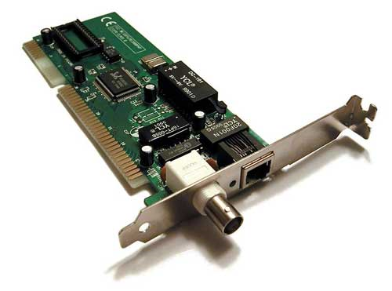
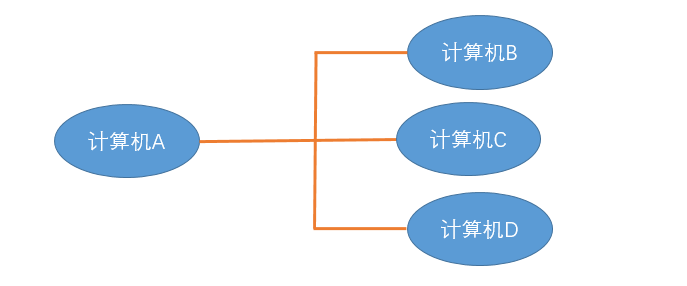
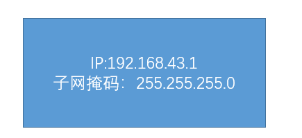
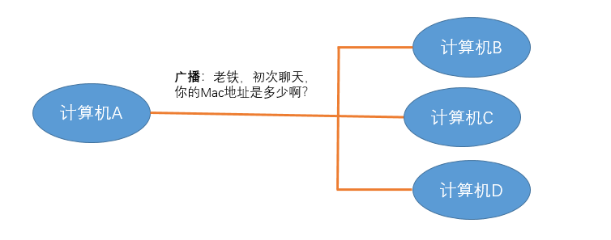

# 4层模型简介

https://www.cnblogs.com/kubidemanong/p/10475024.html

### 1. 物理层

　　光纤，电缆，双绞线等介质

　　物理层负责把两台计算机连起来，然后在计算机之间通过高低电频来传送0,1这样的电信号。

### 2. 数据链路层

　　因此，我们需要制定一套规则来进行0，1的传送。例如多少个电信号为一组啊，每一组信号应该如何标识才能让计算机读懂啊等等。

　　于是，有了以太网协议。

**1. 以太网协议**

　　以太网协议规定，一组电信号构成一个数据包，我们把这个数据包称之为**帧**。每一个桢由标头(Head)和数据(Data)两部分组成。

　　帧的大小一般为 64 - 1518 个字节。假如需要传送的数据很大的话，就分成多个桢来进行传送。

　　标头部分主要是一些说明数据，例如发送者，接收者等信息。而数据部分则是这个数据包具体的，想给接守者的内容。

　　标头部分的字节是固定的，并且固定为18个字节。

　　把一台计算的的数据通过物理层和链路层发送给另一台计算机，究竟是谁发给谁的，计算机与计算机之间如何区分，，你总得给他们一个唯一的标识吧？

　　于是，MAC 地址出现了。

**2. MAC 地址**

　　连入网络的每一个计算机都会有网卡接口，每一个网卡都会有一个唯一的地址，这个地址就叫做 MAC 地址。计算机之间的数据传送，就是通过 MAC 地址来唯一寻找、传送的。

　　MAC地址 由 48 个字节所构成，在网卡生产时就被唯一标识了。

**3. 广播与ARP协议**

**(1). 广播**

　　在同一个**子网**中，计算机 A 要向计算机 B 发送一个数据包，这个数据包会包含接收者的 MAC 地址。当发送时，计算机 A 是通过**广播**的方式发送的，这时同一个子网中的计算机 C, D 也会收到这个数据包的，然后收到这个数据包的计算机，会把数据包的 MAC 地址取出来，与自身的 MAC 地址对比，如果两者相同，则接受这个数据包，否则就丢弃这个数据包。这种发送方式我们称之为广播。

**(2). ARP 协议**。

那么问题来了，计算机 A 是如何知道计算机 B 的 MAC 地址的呢？这个时候就得由 ARP 协议这个家伙来解决了，不过 ARP 协议会涉及到IP地址，我们下面才会扯到IP地址。因此我们先放着，就当作是有这么一个 ARP 协议，通过它我们可以知道子网中其他计算机的 MAC 地址。

### 3. 网络层

　　实际上我们所处的网络，是由无数个子网络构成的。广播的时候，也只有同一个子网里面的计算机能够收到。

　　那么问题来了，我们如何区分哪些 MAC 地址是属于同一个子网的呢？假如是同一个子网，那我们就用广播的形式把数据传送给对方，如果不是同一个子网的，我们就会把数据发给网关，让网关进行转发。

　　为了解决这个问题，于是，有了 IP 协议。

**1. IP协议**

　　IP协议，它所定义的地址，我们称之为**IP地址**。IP协议有两种版本，一种是 IPv4,另一种是 IPv6。不过我们目前大多数用的还是 IPv4，我们现在也只讨论 IPv4 这个版本的协议。

　　这个 IP 地址由 32 位的二进制数组成，我们一般把它分成4段的十进制表示，地址范围为0.0.0.0~255.255.255.255。

　　每一台想要联网的计算机都会有一个IP地址。这个IP地址被分为两部分，前面一部分代表**网络部分**，后面一部分代表**主机部分**。并且网络部分和主机部分所占用的二进制位数是不固定的。

　　假如两台计算机的网络部分是一模一样的，我们就说这两台计算机是处于同一个子网中。例如 192.168.43.1 和 192.168.43.2, 假如这两个 IP 地址的网络部分为 24 位，主机部分为 8 位。那么他们的网络部分都为 192.168.43，所以他们处于同一个子网中。

　　可是问题来了，你怎么知道网络部分是占几位，主机部分又是占几位呢？也就是说，单单从两台计算机的IP地址，我们是无法判断他们的是否处于同一个子网中的。

　　这就引申出了另一个关键词————**子网掩码**。子网掩码和IP地址一样也是 32 位二进制数，不过它的网络部分规定全部为 1，主机部分规定全部为 0.也就是说，假如上面那两个IP地址的网络部分为 24 位，主机部分为 8 位的话，那他们的子网掩码都为 11111111.11111111.11111111.00000000，即255.255.255.0。

　　那有了子网掩码，如何来判端IP地址是否处于同一个子网中呢。显然，知道了子网掩码，相当于我们知道了网络部分是几位，主机部分是几位。我们只需要把 IP 地址与它的子网掩码做与(and)运算，然后把各自的结果进行比较就行了，如果比较的结果相同，则代表是同一个子网，否则不是同一个子网。

　　例如，192.168.43.1和192.168.43.2的子码掩码都为255.255.255.0，把IP与子码掩码相与，可以得到他们都为192.168.43.0，进而他们处于同一个子网中。

**2. ARP协议**

　　有了两台计算机的IP地址与子网掩码，我们就可以判断出它们是否处于同一个子网之中了。

　　假如他们处于同一个子网之中，计算机A要给计算机B发送数据时。我们可以通过ARP协议来得到计算机B的MAC地址。

　　ARP协议也是通过广播的形式给同一个子网中的每台电脑发送一个数据包(当然，这个数据包会包含接收方的IP地址)。对方收到这个数据包之后，会取出IP地址与自身的对比，如果相同，则把自己的MAC地址回复给对方，否则就丢弃这个数据包。这样，计算机A就能知道计算机B的MAC地址了。

　　可能有人会问，知道了MAC地址之后，发送数据是通过广播的形式发送，询问对方的MAC地址也是通过广播的形式来发送，那其他计算机怎么知道你是要传送数据还是要询问MAC地址呢？其实在询问MAC地址的数据包中，在对方的MAC地址这一栏中，填的是一个特殊的MAC地址，其他计算机看到这个特殊的MAC地址之后，就能知道广播想干嘛了。

　　假如两台计算机的IP不是处于同一个子网之中，这个时候，我们就会把数据包发送给网关，然后让网关让我们进行转发传送

### 4. 传输层

　　通过物理层、数据链路层以及网络层的互相帮助，我们已经把数据成功从计算机A传送到计算机B了，可是，计算机B里面有各种各样的应用程序，计算机该如何知道这些数据是给谁的呢？

　　这个时候，**端口(Port)**这个家伙就上场了，也就是说，我们在从计算机A传数据给计算表B的时候，还得指定一个端口，以供特定的应用程序来接受处理。

　　也就是说，传输层的功能就是建立端口到端口的通信。相比网络层的功能是建立主机到主机的通信。

　　传输层最常见的两大协议是 TCP 协议和 UDP 协议，其中 TCP 协议与 UDP 最大的不同就是 TCP 提供可靠的传输，而 UDP 提供的是不可靠传输。

### 5. 应用层